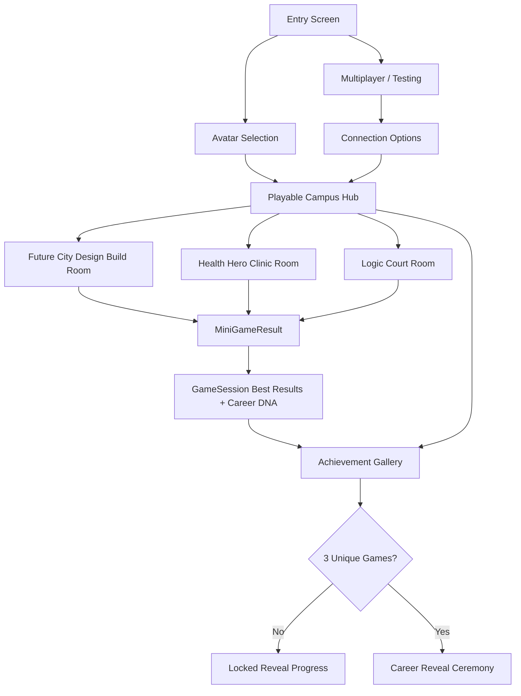
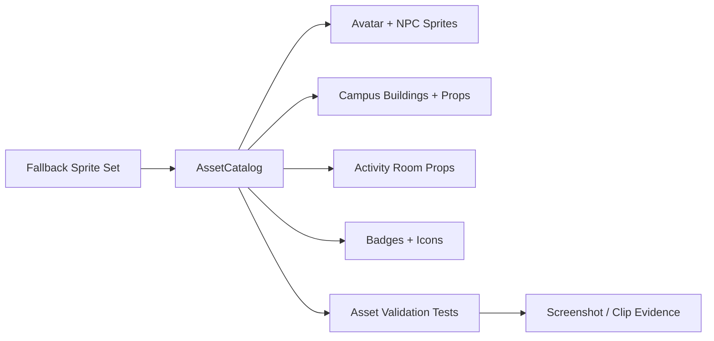
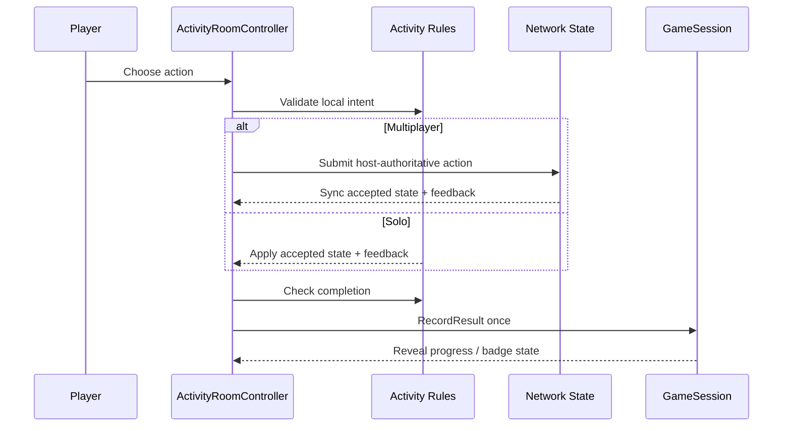

# Career Quest Full Vision Implementation Plan

## Summary

Turn Career Quest Campus from a UI-led prototype into a credible first-playable Unity game: sprite-led avatar selection, a walkable campus hub, visible characters and room environments, longer interactive activities, multiplayer-aware shared state for all three mini-games, a three-game Career Reveal gate, and a Windows-first release package with proof artifacts.

The plan preserves the current `main` branch runtime promise: one persistent Unity scene, no accounts or child-data persistence, Play as the honest path, Showcase as a guided evaluator path, and `GameSession` as the result/reveal source of truth.

Engineering review update: the next implementation slice is **hybrid visual-first**. Build the visible game first: real character sprites, a polished campus, a clean HUD, and one beautiful activity-room template. Add only the shared activity framework needed to make that first polished room reusable; defer broader multiplayer/activity rewrites until the visual bar is proven in screenshots.

---

## Problem Frame

The current build has important systems in place, but it still reads as a polished menu prototype rather than a video game. Most environments and characters are generated procedurally by `CampusWorldController`, activities render as UI panels, and only `DesignBuildNetworkState` has a first pass at shared multiplayer state. The reveal gate is already corrected to three unique games in `GameSession`, but the user-facing journey needs a stronger character/world/activity layer so that "play three career challenges, earn badges, reveal strengths" feels earned.

This plan fills the remaining CEO, engineering, and creative gaps without discarding the working code. The highest-value move is to introduce a prefab/sprite art layer and shared activity framework, then migrate each activity into room-scale interactions that still emit the existing `MiniGameResult` contract.

The main failure mode to avoid is an implementation that passes unit tests while still looking like colored rectangles and menu buttons. Player-facing completion now requires visual proof: screenshots must show game-quality avatars/NPCs, recognizable room props, readable environments, and UI that behaves like a quest HUD rather than a blocking menu.

---

## Requirements

**Game Identity And Visual Baseline**

- R1. The first minute of Play must show a chosen avatar, visible campus environment, interactable destination entrances, and at least one NPC or guide character.
- R2. The game must use a generated sprite kit or curated sprite assets for avatars, NPCs, buildings, badges, activity props, room backgrounds, and core UI icons.
- R2a. Main-path avatars and NPCs must look like real 2D video game characters, not procedural block figures: visible head/face, hair or headwear, torso, arms, legs, silhouette, outfit/accent, and readable pose at gameplay scale.
- R3. Every major screen must have visual environment context behind or around the UI; no core experience may feel like only floating text buttons on a flat panel.
- R4. The art style must stay kid-friendly, colorful, readable, and lightweight enough for the current Unity 2D/2.5D stack.
- R5. A fallback asset path must keep the game playable if a generated sprite is missing, but fallback/procedural sprites do not satisfy player-facing visual acceptance for avatars, NPCs, buildings, room backdrops, primary props, or badge art.

**Avatar, Hub, And Navigation**

- R6. Avatar selection must be a character/avatar screen with visible character cards, selected-state preview, and persisted selected avatar across hub, activities, gallery, and reveal.
- R7. The Play path must enter a walkable campus hub instead of routing directly through menu-like screens.
- R7a. Normal Play must be `Play -> Avatar Selection -> Campus`. Multiplayer/connection choices are secondary testing options, not the default first-run path.
- R8. The hub must support keyboard movement, click/tap-friendly destination entry, clear building labels, and a guide/NPC prompt that keeps the loop understandable.
- R9. The player must be able to return to hub from activities, gallery, and reveal.
- R10. An Exit Game control must remain available from entry, hub, activities, gallery, reveal, and Showcase states.

**Mini-Games**

- R11. Future City Design Build must become a longer, more interactive room challenge with review, planning, placement, validation, completion ceremony, and visible city pieces.
- R12. Health Hero Clinic must become a longer, more interactive room challenge with symptom inspection, tool choice, care-plan choice, feedback, mistakes, and completion ceremony.
- R13. Logic Court must become a longer, more interactive room challenge with case review, evidence sorting, argument assembly, feedback, mistakes, and completion ceremony.
- R14. Each mini-game must have a clear start state, mid-game progress state, success/practice result state, and exit/return state.
- R15. Each mini-game must keep emitting exactly one best-result candidate per unique activity completion through `MiniGameResult` and `GameSession.RecordResult`.

**Multiplayer**

- R16. Host-authoritative state must exist for all three activities, not only Design Build.
- R17. Host and client must both see meaningful shared progress and feedback in each activity.
- R18. Duplicate, invalid, or conflicting actions must be deterministic and must not record duplicate results.
- R19. Same-computer host/client proof remains the required multiplayer proof path; LAN remains useful but non-blocking unless manually verified.
- R20. Solo and Solo Fallback must continue working through the same activity rules where practical.

**Gallery, Career DNA, And Reveal**

- R21. Career Reveal must unlock only after three unique games are completed.
- R22. Gallery must show badges/progress for all three activities and make reveal progress clear.
- R23. Career DNA must remain strength-based and avoid deterministic "you should become X" language.
- R24. Showcase may seed or guide state, but it must remain transparent in debug/QA surfaces and may not make Play appear more complete than it is.
- R25. Completion ceremonies must make badge earning and reveal readiness visually obvious.

**Quality, Evidence, And Release**

- R26. Every implementation unit must include automated tests where Unity test coverage is practical.
- R27. Every visual/gameplay milestone must include screenshot or short clip evidence.
- R27a. Visual milestones must include a 1280x720 screenshot from the built player or Unity Game view and must call out whether any player-facing fallback art remains.
- R28. The release target is a Windows build first; WebGL is optional and must be labeled limited if not fully verified.
- R29. The build must stay on `main`; feature work lands as incremental commits that keep the project launchable.
- R30. No analytics, accounts, chat, telemetry, saved child profiles, or child-identifying tracking may be added.
- R31. Immediate implementation units must include execution notes, likely files, test targets, and dependency order so `ce-work` can dispatch subagents safely.

---

## Key Technical Decisions

- **KTD1: Keep the one-scene architecture.** Retain the existing persistent Unity scene and mode routing to avoid Netcode scene-transition risk. Build the new game feel through instantiated world, avatar, room, and UI controllers inside that scene.
- **KTD2: Migrate from procedural-only visuals to prefab-backed sprites.** `CampusWorldController` can remain as a compatibility shell, but new environments should use prefab/sprite catalogs so art can be reviewed, reused, and tested.
- **KTD3: Make `GameSession` the single result gate.** The current `UniqueCompletedGames`, `GamesNeededForReveal`, and `RevealReady` semantics stay authoritative. Activities emit result candidates; `GameSession` decides best-result and reveal readiness.
- **KTD4: Introduce a shared activity contract before rewriting every room.** A small `ActivitySessionState` / `ActivityLifecycle` layer avoids three separate multiplayer state machines and gives tests one place to prove idempotence.
- **KTD5: Host-authoritative multiplayer, same rules for solo.** Networked activities use server-approved actions and synced state. Solo paths call the same rule reducers locally where possible.
- **KTD6: Generated sprite kit is allowed, but cataloged.** Generated art must be imported through typed IDs, validation, fallback sprites, and size/performance budgets. Untracked ad hoc images should not leak into scene code.
- **KTD7: Design Build goes first.** It already has rule and network scaffolding, so it should become the template for the longer room loop before Health Hero and Logic Court are expanded.
- **KTD8: Showcase follows reality.** Showcase can guide and seed, but it should showcase the same avatar, hub, room, gallery, and reveal systems rather than a separate fake path.
- **KTD9: Windows-first QA.** WebGL remains optional until input, audio, performance, and Netcode limitations are explicitly verified and documented.
- **KTD10: Hybrid visual-first execution.** Implement the next slice as polished art and UX first, plus only the shared activity framework needed for the first polished activity room. Do not let full multiplayer rewrites delay the visual baseline.
- **KTD11: Fallback art is QA-only for player-facing done states.** `SpriteFallbackFactory` remains useful for safety and tests, but a screen is not visually complete while the selected avatar, guide/NPC, primary buildings, room backdrop, or core props are fallback-generated.
- **KTD12: Normal Play bypasses connection setup.** The kid-facing route should default to solo campus after avatar choice. Connection/host/join remains available from a secondary `Multiplayer / Testing` action and from QA/debug flows.
- **KTD13: Screenshot QA is an engineering gate.** Add named visual QA states for entry, avatar, campus, the polished room, gallery, locked reveal, and unlocked reveal. A milestone cannot be called done without captured proof and a fallback-art note.
- **KTD14: Work is split into subagent-safe visual lanes.** The immediate execution slice should be assigned as separable lanes with explicit files and verification so `ce-work` can use serial or parallel subagents without turning the full plan into one large context window.

---

## High-Level Technical Design

---

## Implementation Units

### Hybrid Visual-First Execution Order

Use this execution slice before continuing the broader U1-U12 plan. Treat it as the active `ce-work` target.

| Lane | Scope | Primary units | Subagent posture | Done when |
|------|-------|---------------|------------------|-----------|
| H1 | Visual QA harness and named capture states | U1, U12 | Serial first; it touches app routing and QA docs | Named states can show avatar, campus, Design Build, Gallery, locked Reveal, and unlocked Reveal with fallback-art notes. |
| H2 | Real sprite kit gate | U2, U3 | Can run in parallel after H1 route names settle | Main avatar/NPC sprites, primary buildings, room backdrop, props, badges, and core icons are cataloged and non-fallback on player-facing screens. |
| H3 | Main path and campus polish | U1, U4, U10 | Serial after H1/H2 because it touches the same app and HUD surfaces | Normal Play enters campus after avatar choice; campus reads as a game board with doors/signs and compact badge HUD. |
| H4 | Polished Design Build template | U5, U6, U9 | Serial or isolated subagent; it creates the reusable activity-room pattern | Design Build shows a real room, helper NPC, direct-manipulation props, immediate feedback, completion ceremony, and idempotent result recording. |
| H5 | Extend the proven template | U7, U8, U11 | Parallel candidates after H4 template is merged | Health Hero, Logic Court, and Showcase reuse the proven room/HUD/feedback pattern instead of inventing separate visual systems. |

The broader shared activity framework should grow out of H4. Do not build a large abstract framework before the first room looks and feels right.

### U1. Scene Flow Foundation And Compatibility Harness

**Goal.** Keep the existing launch loop stable while creating room for prefab-backed hub and activity flows.

**Execution note.** Route and QA-harness work first. Keep this unit focused on state transitions, command-line/named-state entry points, and route tests; leave art polish to U2-U4.

**Files.**

- Modify `Assets/_CareerQuest/Scripts/UI/CareerQuestApp.cs`
- Modify `Assets/_CareerQuest/Scripts/Core/GameSession.cs`
- Create `Assets/_CareerQuest/Scripts/Core/SceneFlowRouter.cs`
- Create `Assets/_CareerQuest/Scripts/Core/ActivityRoute.cs`
- Create `Assets/_CareerQuest/Tests/EditMode/SceneFlowRouterTests.cs`
- Update `Assets/_CareerQuest/Tests/PlayMode/EntryFlowTests.cs`

**Work.**

- Extract route decisions from `CareerQuestApp` into a small `SceneFlowRouter` that knows entry, avatar, connection, hub, activity rooms, gallery, reveal, and quit routes.
- Change normal Play to route `Play -> Avatar Selection -> Campus` using solo/free-campus defaults.
- Move connection choices behind a secondary `Multiplayer / Testing` entry action and keep the connection screen available for QA, host/client proof, and LAN testing.
- Preserve public app methods used by current tests and UI callbacks.
- Keep `QuitGame` available through a stable app-level command.
- Add named visual QA route states for avatar selection, campus, Design Build room, Gallery, locked Reveal, and unlocked Reveal.
- Add route assertions for Play, Showcase, activity return-to-hub, gallery, locked reveal, unlocked reveal, and exit button visibility.

**Acceptance.**

- Existing PlayMode entry tests still pass.
- `CareerQuestApp` becomes orchestration code instead of containing every state transition directly.
- Normal Play no longer shows connection choices before campus.
- There is no behavior regression for entry, avatar, secondary connection, Showcase, gallery, reveal, or quit.

### U2. Asset Catalog And Generated Sprite Kit Pipeline

**Goal.** Add a typed asset layer so generated art becomes a dependable part of the game rather than loose files.

**Execution note.** This is an art/catalog lane and can be handled by a separate subagent after route-state names are stable. Do not rewrite gameplay loops here except where needed to expose non-fallback sprite checks.

**Files.**

- Create `Assets/_CareerQuest/Scripts/Art/AssetCatalog.cs`
- Create `Assets/_CareerQuest/Scripts/Art/AssetDefinition.cs`
- Create `Assets/_CareerQuest/Scripts/Art/AssetCategory.cs`
- Create `Assets/_CareerQuest/Scripts/Art/SpriteFallbackFactory.cs`
- Create `Assets/_CareerQuest/Art/Avatars/`
- Create `Assets/_CareerQuest/Art/Npcs/`
- Create `Assets/_CareerQuest/Art/Campus/`
- Create `Assets/_CareerQuest/Art/Rooms/`
- Create `Assets/_CareerQuest/Art/Badges/`
- Create `Assets/_CareerQuest/Art/UI/`
- Create `Assets/_CareerQuest/Tests/EditMode/AssetCatalogTests.cs`
- Create `Assets/_CareerQuest/Tests/EditMode/AssetValidationTests.cs`
- Update `docs/art-direction.md`

**Work.**

- Define asset IDs for all avatar, NPC, building, room, prop, badge, and UI icon sprites needed by the first playable.
- Import or generate a first sprite kit using a consistent art brief: kid-friendly 2D classroom/campus adventure, crisp readable silhouettes, transparent backgrounds for characters/props, warm daylight campus, clean room backgrounds.
- Require main-path character sprites to include a game-character silhouette with face, hair/headwear, outfit detail, arms, legs, and readable personality at gameplay scale.
- Store source prompts/briefs in `docs/art-direction.md` and imported outputs in the matching `Assets/_CareerQuest/Art/...` folders.
- Provide fallback generated shapes through `SpriteFallbackFactory` so a missing art file degrades gracefully.
- Add validation tests for required IDs, fallback presence, texture dimensions, category coverage, and player-facing fallback usage.
- Add a way for tests/QA to identify whether a displayed sprite is fallback-generated or imported/generated final art.

**Acceptance.**

- The game can request art by stable ID without hard-coded paths in gameplay controllers.
- Missing art is visible as a deliberate fallback, not a broken/null sprite.
- Main-path visual acceptance fails if selected avatars, guide/NPCs, primary buildings, room backdrops, Design Build props, or badges are still using fallback sprites.
- The art direction doc records the sprite-kit brief and review notes.

### U3. Avatar Selection And Identity Persistence

**Goal.** Make avatar choice feel like choosing a playable character.

**Execution note.** Keep this unit focused on character identity, preview cards, selected-state persistence, and real sprites. It may run after U2 or in parallel if the catalog contract is already stable.

**Files.**

- Modify `Assets/_CareerQuest/Scripts/Config/AvatarConfig.cs`
- Modify `Assets/_CareerQuest/Scripts/UI/AvatarSelectionController.cs`
- Modify `Assets/_CareerQuest/Scripts/Networking/PlayerAvatarNetwork.cs`
- Create `Assets/_CareerQuest/Scripts/Avatar/AvatarPreviewController.cs`
- Create `Assets/_CareerQuest/Scripts/Avatar/AvatarRuntimeView.cs`
- Create `Assets/_CareerQuest/Tests/EditMode/AvatarConfigTests.cs`
- Create `Assets/_CareerQuest/Tests/PlayMode/AvatarSelectionFlowTests.cs`

**Work.**

- Extend `AvatarDefinition` with sprite asset ID, palette/accent IDs, short personality label, and optional NPC counterpart.
- Render avatar cards with real sprites, selected state, large preview, and clear confirm/back controls.
- Carry selected avatar into hub player view, activity room player marker, gallery, reveal, and `PlayerAvatarNetwork` sync.
- Make Showcase use the same avatar selection screen before its guided path.
- Rename confirm copy to `Enter Campus` or `Start Quest`; avoid generic `Start`.
- Show the selected avatar as a large game-character preview on a platform/passport-style surface.

**Acceptance.**

- A selected avatar visibly appears in the next scene state.
- Avatar cards and the in-world player use real imported/generated character sprites, not procedural fallback characters.
- Host/client avatar identity can be observed in multiplayer proof.
- Tests confirm selected avatar persists through hub, activity, gallery, and reveal route transitions.

### U4. Playable Campus Hub And Guide Character

**Goal.** Replace menu-like campus navigation with a navigable game space.

**Execution note.** This is the main world-polish lane. Run after U1 and ideally after U2/U3 so the hub can use final sprites instead of procedural stand-ins.

**Files.**

- Modify `Assets/_CareerQuest/Scripts/World/CampusWorldController.cs`
- Create `Assets/_CareerQuest/Scripts/Hub/PlayableHubController.cs`
- Create `Assets/_CareerQuest/Scripts/Hub/PlayerAvatarController.cs`
- Create `Assets/_CareerQuest/Scripts/Hub/BuildingEntrance.cs`
- Create `Assets/_CareerQuest/Scripts/Hub/CampusGuideController.cs`
- Create `Assets/_CareerQuest/Scripts/Hub/HubCameraRig.cs`
- Create `Assets/_CareerQuest/Tests/EditMode/HubDestinationTests.cs`
- Create `Assets/_CareerQuest/Tests/PlayMode/HubNavigationFlowTests.cs`

**Work.**

- Build a campus layout with three primary destinations: Future City Studio, Health Hero Clinic, and Logic Court.
- Add future-label destinations only as visual promise, not fake playable content.
- Add keyboard movement, simple bounds/collision, destination trigger/click entry, camera framing, and guide/NPC prompt.
- Keep UI destination buttons only as accessibility/backup controls in a compact HUD; the screen must not read as a row of floating menu buttons.
- Add a compact badge/progress HUD that does not cover the world.
- Add door signs, entrance highlights, and guide/NPC speech bubble guidance.
- Ensure exit, gallery, and locked/unlocked reveal controls are available from the hub.

**Acceptance.**

- A player can move an avatar around the campus and enter each implemented activity.
- The campus reads as an environment at desktop resolution without requiring explanatory text.
- Screenshot evidence shows a real avatar sprite, guide/NPC, primary buildings, door signs, compact HUD, badge progress, and reveal/gallery access without oversized text or UI covering the world.

### U5. Shared Activity Framework

**Goal.** Create only the lifecycle and state contract needed to make the first polished room reusable, then expand it after the visual template works.

**Execution note.** Keep this minimal and Design Build-led. Do not build a broad framework for all activities until U6 proves the room/HUD/feedback pattern visually.

**Files.**

- Create `Assets/_CareerQuest/Scripts/Activities/Shared/ActivitySessionState.cs`
- Create `Assets/_CareerQuest/Scripts/Activities/Shared/ActivityLifecycle.cs`
- Create `Assets/_CareerQuest/Scripts/Activities/Shared/ActivityAction.cs`
- Create `Assets/_CareerQuest/Scripts/Activities/Shared/ActivityFeedback.cs`
- Create `Assets/_CareerQuest/Scripts/Activities/Shared/ActivityRoomController.cs`
- Create `Assets/_CareerQuest/Scripts/Activities/Shared/ActivityResultEmitter.cs`
- Create `Assets/_CareerQuest/Tests/EditMode/ActivityLifecycleTests.cs`
- Create `Assets/_CareerQuest/Tests/EditMode/ActivityResultEmitterTests.cs`

**Work.**

- Define canonical phases: `Intro`, `Explore`, `Interact`, `Review`, `Complete`, `ResultRecorded`, and `Exit`.
- Define an action/reducer pattern for validating actions and emitting feedback.
- Add idempotent result emission so repeated completion clicks, duplicate network events, or host/client races cannot record duplicate results.
- Provide a thin adapter for Design Build first. Do not generalize for all rooms until the Design Build room has passed visual QA.
- Keep the API small enough that Health Hero and Logic Court can adopt it later without forcing their complete rewrite now.

**Acceptance.**

- Shared tests prove duplicate completion records once.
- Design Build can migrate without changing the `MiniGameResult` constructor contract.
- Solo and multiplayer paths can use the same activity phase semantics.

### U6. Future City Design Build Room Rewrite

**Goal.** Make the strongest current activity feel like the multiplayer showpiece and template room.

**Execution note.** This is the first polished room lane and should run after U2/U5. It owns the reusable visual standard for later rooms, so screenshot proof is part of the unit, not a later release chore.

**Files.**

- Modify `Assets/_CareerQuest/Scripts/Activities/DesignBuild/DesignBuildController.cs`
- Modify `Assets/_CareerQuest/Scripts/Activities/DesignBuild/DesignBuildNetworkState.cs`
- Modify `Assets/_CareerQuest/Scripts/Activities/DesignBuild/FutureCityBlueprint.cs`
- Create `Assets/_CareerQuest/Scripts/Activities/DesignBuild/DesignBuildRoomController.cs`
- Create `Assets/_CareerQuest/Scripts/Activities/DesignBuild/DesignBuildPieceView.cs`
- Create `Assets/_CareerQuest/Scripts/Activities/DesignBuild/DesignBuildSharedState.cs`
- Update `Assets/_CareerQuest/Tests/EditMode/DesignBuildRulesTests.cs`
- Update `Assets/_CareerQuest/Tests/PlayMode/DesignBuildFlowTests.cs`
- Create `Assets/_CareerQuest/Tests/EditMode/DesignBuildSharedStateTests.cs`

**Work.**

- Expand the loop: brief, blueprint review, helper clue, choose/move/place pieces, validate placements, complete skyline, badge ceremony.
- Render a real room/workbench, helper NPC, visible city pieces, tool props, badge stamp, and skyline preview using `AssetCatalog`.
- Sync accepted placements, invalid-action feedback, completion state, and result-ready state through host authority.
- Track both players' visible contributions for the multiplayer wow moment.
- Keep solo play using the same validation rules.
- Replace the full-screen button-panel feel with room props/cards, direct manipulation where practical, speech-bubble feedback, and a badge ceremony.

**Acceptance.**

- Host and client can both place or attempt pieces and see shared progress.
- Completion records one Design Build result.
- Screenshot evidence shows the room as a game scene, not a full-screen button panel.
- The room takes long enough to feel like a game challenge without becoming tedious.

### U7. Health Hero Clinic Room Rewrite

**Goal.** Expand Health Hero into a playable diagnostic room with shared progress.

**Files.**

- Modify `Assets/_CareerQuest/Scripts/Activities/HealthHero/HealthHeroController.cs`
- Modify `Assets/_CareerQuest/Scripts/Activities/HealthHero/HealthHeroCase.cs`
- Create `Assets/_CareerQuest/Scripts/Activities/HealthHero/HealthHeroRoomController.cs`
- Create `Assets/_CareerQuest/Scripts/Activities/HealthHero/HealthHeroSharedState.cs`
- Create `Assets/_CareerQuest/Scripts/Activities/HealthHero/HealthHeroNetworkState.cs`
- Create `Assets/_CareerQuest/Tests/EditMode/HealthHeroSharedStateTests.cs`
- Update `Assets/_CareerQuest/Tests/PlayMode/OptionalMiniGameFlowTests.cs`

**Work.**

- Expand the loop: greet patient, inspect symptoms, choose tool, read result, choose care plan, complete case.
- Add at least one wrong tool and one wrong care path with supportive feedback.
- Sync symptom/tool/care progress and feedback in multiplayer.
- Emit Practice vs Degree result based on mistakes/time/required steps.

**Acceptance.**

- The room is interactive enough to last materially longer than the current button sequence.
- Host/client shared state is visible and deterministic.
- A valid completion records one Health Hero result and increments reveal progress.

### U8. Logic Court Room Rewrite

**Goal.** Expand Logic Court into a playable evidence-and-argument room with shared progress.

**Files.**

- Modify `Assets/_CareerQuest/Scripts/Activities/LogicCourt/LogicCourtController.cs`
- Modify `Assets/_CareerQuest/Scripts/Activities/LogicCourt/EvidenceCard.cs`
- Create `Assets/_CareerQuest/Scripts/Activities/LogicCourt/LogicCourtRoomController.cs`
- Create `Assets/_CareerQuest/Scripts/Activities/LogicCourt/LogicCourtSharedState.cs`
- Create `Assets/_CareerQuest/Scripts/Activities/LogicCourt/LogicCourtNetworkState.cs`
- Create `Assets/_CareerQuest/Tests/EditMode/LogicCourtSharedStateTests.cs`
- Update `Assets/_CareerQuest/Tests/PlayMode/OptionalMiniGameFlowTests.cs`

**Work.**

- Expand the loop: review case, inspect evidence, sort helpful/unhelpful, assemble closing argument, present conclusion.
- Add visible cards, evidence board, courtroom stage, and argument meter.
- Sync evidence sorting, rejected evidence, argument readiness, feedback, and completion through host authority.
- Emit Practice vs Degree based on correct sorting and mistake count.

**Acceptance.**

- The room has meaningful interactions beyond clicking the correct sequence once.
- Host/client both see sorted evidence and final argument readiness.
- A valid completion records one Logic Court result and increments reveal progress.

### U9. Feedback, Audio, And Ceremony Layer

**Goal.** Make progress, mistakes, badge earning, and reveal readiness feel responsive and celebratory.

**Files.**

- Create `Assets/_CareerQuest/Scripts/Feedback/FeedbackController.cs`
- Create `Assets/_CareerQuest/Scripts/Feedback/FeedbackCue.cs`
- Create `Assets/_CareerQuest/Scripts/Feedback/AudioCueCatalog.cs`
- Create `Assets/_CareerQuest/Scripts/Feedback/CeremonyController.cs`
- Modify activity room controllers, `Assets/_CareerQuest/Scripts/UI/AchievementGalleryController.cs`, and `Assets/_CareerQuest/Scripts/UI/CareerRevealController.cs`
- Create `Assets/_CareerQuest/Tests/EditMode/FeedbackCueTests.cs`

**Work.**

- Add standard cues for accepted action, rejected action, checkpoint complete, badge earned, reveal locked, reveal unlocked, and activity complete.
- Add lightweight audio stubs or generated simple tones if imported audio is unavailable.
- Add animation-friendly state hooks without making animation a blocker.
- Make feedback replicated or locally mirrored when a multiplayer action changes shared state.

**Acceptance.**

- Activity success and invalid choices are immediately legible.
- Badge/reveal ceremonies can be captured clearly in screenshots or clips.
- Missing audio does not block gameplay.

### U10. Gallery And Three-Game Reveal Ceremony

**Goal.** Make the three-game gate a visible achievement path rather than a hidden condition.

**Files.**

- Modify `Assets/_CareerQuest/Scripts/UI/AchievementGalleryController.cs`
- Modify `Assets/_CareerQuest/Scripts/UI/CareerRevealController.cs`
- Modify `Assets/_CareerQuest/Scripts/Core/GameSession.cs`
- Modify `Assets/_CareerQuest/Scripts/Config/CareerConfig.cs`
- Modify `Assets/_CareerQuest/Scripts/Config/ShowcaseSeedConfig.cs`
- Update `Assets/_CareerQuest/Tests/EditMode/GameSessionTests.cs`
- Update `Assets/_CareerQuest/Tests/PlayMode/ShowcaseRevealFlowTests.cs`

**Work.**

- Keep `RevealReady == UniqueCompletedGames >= 3`.
- Show three badge slots, completed status, "games to go" copy, and locked reveal affordance in Gallery and Hub.
- Make reveal ceremony use avatar, badge set, top traits, co-leads, confidence phrase, and strength-based disclaimer.
- Ensure Showcase seeds or guides exactly three unique results before reveal.

**Acceptance.**

- Reveal stays locked after zero, one, or two unique games.
- Reveal unlocks after exactly three unique games.
- Showcase reveal remains transparent in debug/QA and uses the same reveal controller.

### U11. Showcase Alignment And Release Proof

**Goal.** Keep Showcase useful after the real game loop expands.

**Files.**

- Modify `Assets/_CareerQuest/Scripts/Showcase/ShowcasePresenter.cs`
- Modify `Assets/_CareerQuest/Scripts/Showcase/ShowcaseStep.cs`
- Modify `Assets/_CareerQuest/Scripts/UI/ShowcaseDisclaimerController.cs`
- Update `Assets/_CareerQuest/Tests/EditMode/ShowcaseSequenceTests.cs`
- Update `Assets/_CareerQuest/Tests/PlayMode/ShowcaseRevealFlowTests.cs`
- Update `docs/demo-checklist.md`

**Work.**

- Route Showcase through avatar selection, campus hub, one highlighted room sequence, gallery, and three-result reveal.
- Avoid old one-result reveal assumptions.
- Keep the split/simulated proof copy honest and aligned with real host/client QA evidence.
- Ensure Showcase still fits an evaluator-friendly timebox, but does not replace Play.

**Acceptance.**

- Showcase sequence includes avatar, hub, activity, gallery, and reveal.
- Showcase cannot reveal before the session has three unique seeded or played results.
- Documentation explains what is guided vs live.

### U12. QA, Performance, And Distribution Gates

**Goal.** Attach evidence and release confidence to every visible promise.

**Execution note.** Start the visual QA harness early with U1, then keep updating the QA evidence as each visual unit lands. Screenshots are an engineering gate for visual completion, not a final documentation sweep.

**Files.**

- Create `docs/qa/2026-06-09-full-vision-playable-smoke.md`
- Update `docs/qa/2026-06-09-showcase-smoke.md`
- Update `docs/demo-checklist.md`
- Update `docs/architecture.md`
- Update `README.md`
- Create `Assets/_CareerQuest/Tests/PlayMode/FullLoopSmokeTests.cs`

**Work.**

- Add a QA matrix for Play, Showcase, solo fallback, same-computer host/client, exit button, avatar persistence, hub navigation, each room, gallery, reveal lock/unlock, and Windows build.
- Capture screenshots or short clips for avatar selection, hub, each room, multiplayer proof, gallery, locked reveal, unlocked reveal, and exit path.
- Add named visual QA capture states for entry, avatar selection, campus, Design Build room, Gallery, locked Reveal, and unlocked Reveal.
- Record whether each screenshot still contains fallback/procedural player-facing art. Fallbacks are acceptable for safety, but they must be listed as blockers for visual-complete milestones.
- Include a checklist that explicitly marks selected avatar, guide/NPC, primary buildings, room backdrop, primary props, badges, and core UI icons as final art or fallback art.
- Record performance budgets: stable desktop frame rate target, texture size limits, startup time, and memory sanity checks for the sprite kit.
- Keep WebGL optional until specifically verified.

**Acceptance.**

- No feature is considered done without a test or explicit manual QA note.
- No visual milestone is considered done while main-path characters, primary buildings, room backdrops, primary props, or badges still use fallback sprites.
- Every visual milestone has screenshot proof from Unity Game view or the Windows build at 1280x720 or larger.
- Windows build proof is the release artifact of record.
- Known limitations are documented without burying them.

---

## Acceptance Examples

- AE1. Given a fresh Play session, when a player selects an avatar and starts, then the player sees that avatar moving in a campus hub with three playable destinations and an Exit Game control.
- AE2. Given a player completes one or two unique games, when they open Gallery or Reveal, then badges/progress show the completed count and Career Reveal remains locked.
- AE3. Given a player completes all three unique games, when they open Reveal, then the reveal ceremony shows career matches, traits, confidence, and strength-based copy.
- AE4. Given host and client are in Future City Design Build, when either player places a valid piece, then both clients see shared progress and only one Design Build result can be recorded.
- AE5. Given host and client are in Health Hero or Logic Court, when one player advances shared activity state, then both clients see the updated room state and feedback.
- AE6. Given a required sprite asset is missing, when the relevant screen renders, then a fallback visual appears and gameplay remains usable.
- AE7. Given Showcase starts, when it reaches reveal, then debug/QA surfaces identify guided or seeded state and the same three-game reveal rule has been satisfied.
- AE8. Given the Windows build is prepared, when QA reviews the release checklist, then screenshots/clips and smoke notes exist for avatar, hub, all rooms, multiplayer proof, gallery, reveal, and exit.
- AE9. Given visual QA captures the main path, when reviewers inspect avatar, campus, and Design Build screenshots, then characters look like polished 2D game characters and the environment reads as a playable campus/room instead of procedural rectangles plus UI.

---

## System-Wide Impact

- `CareerQuestApp` should shrink into route orchestration while hub/activity/world controllers own specific surfaces.
- `CampusWorldController` should move from creating almost all visuals procedurally toward spawning cataloged sprite/prefab views.
- `GameSession` remains central and should be changed carefully because tests already cover reveal, seeded results, co-leads, and confidence copy.
- Activity controllers will grow more stateful; the shared activity framework should start as the minimum Design Build template needed to keep duplicate-result behavior consistent, then expand to multiplayer and other rooms after the visual baseline is proven.
- Netcode coverage expands from movement and Design Build toward all activity rooms, so same-computer host/client QA becomes more important.
- Art import and validation become part of the engineering workflow; visual completeness is no longer a late polish-only concern.

---

## Risks & Dependencies

- **Generated art inconsistency.** Mitigate with a single sprite-kit brief, batch review, catalog validation, and fallback sprites.
- **Fallback art accidentally passing as final.** Mitigate with visual QA screenshots, required non-fallback IDs for main-path objects, and explicit fallback-art notes in QA records.
- **UI covering the game world.** Mitigate by demoting action bars to compact HUD/accessibility controls and making doors, props, speech bubbles, and badge chips carry the primary interaction.
- **Netcode state complexity.** Mitigate by proving the shared activity contract with Design Build first, then reusing the pattern for Clinic and Court.
- **Scope creep in hub exploration.** Keep the hub small: movement, guide, three real entrances, future labels as non-playable flavor.
- **Showcase drifting away from Play.** Route Showcase through the same systems and keep seeded behavior visible in debug/QA only.
- **WebGL uncertainty.** Treat WebGL as optional until tested; do not let it block the Windows build.
- **One-scene controller growth.** Use route/activity/world boundaries to avoid making `CareerQuestApp` or `CampusWorldController` unmaintainable.

---

## Documentation / Operational Notes

- Keep `docs/brainstorms/2026-06-09-career-quest-full-vision-requirements.md` as the source requirements artifact for this plan.
- Keep `docs/art-direction.md` updated with generated sprite prompts, accepted/rejected asset notes, and visual QA decisions.
- Keep `docs/demo-checklist.md` focused on what an evaluator should do and what claims are proven.
- Add each milestone's screenshots or clips to the QA record before marking that milestone complete.
- Work and pushes should continue on `main`.

---

## Sources / Research

- `docs/brainstorms/2026-06-09-career-quest-full-vision-requirements.md` for the locked full-vision requirements.
- `DESIGN.md` for Future Workshop Diorama + Junior Quest UX, real character bar, fallback-art rules, and visual QA expectations.
- `docs/plans/2026-06-09-demo-wow-showcase-plan.md` for the completed Showcase implementation context and existing plan format.
- `docs/architecture.md` for one-scene architecture, host-authoritative multiplayer direction, and result/reveal boundaries.
- `docs/art-direction.md` for current procedural art direction and sprite upgrade goals.
- `docs/demo-checklist.md` for release proof expectations.
- `docs/qa/2026-06-09-showcase-smoke.md` for current QA gaps around manual visual multiplayer proof, forced failures, and distribution.
- `Packages/manifest.json` and `Packages/packages-lock.json` for installed Unity package versions, including Netcode for GameObjects, Unity Transport, UGUI, and Unity Test Framework.
- `Assets/_CareerQuest/Scripts/UI/CareerQuestApp.cs` for current mode routing, exit handling, and UI-driven state transitions.
- `Assets/_CareerQuest/Scripts/World/CampusWorldController.cs` for current procedural world rendering.
- `Assets/_CareerQuest/Scripts/Core/GameSession.cs` for best-result, Career DNA, and three-game reveal semantics.
- `Assets/_CareerQuest/Scripts/Activities/DesignBuild/DesignBuildController.cs` and `Assets/_CareerQuest/Scripts/Activities/DesignBuild/DesignBuildNetworkState.cs` for the strongest current activity and network-state template.
- `Assets/_CareerQuest/Scripts/Activities/HealthHero/HealthHeroController.cs` and `Assets/_CareerQuest/Scripts/Activities/LogicCourt/LogicCourtController.cs` for current optional mini-game scope.
- `Assets/_CareerQuest/Tests/EditMode/GameSessionTests.cs`, `Assets/_CareerQuest/Tests/PlayMode/DesignBuildFlowTests.cs`, and `Assets/_CareerQuest/Tests/PlayMode/OptionalMiniGameFlowTests.cs` for current verification coverage.

## GSTACK REVIEW REPORT

| Review | Trigger | Why | Runs | Status | Findings |
|--------|---------|-----|------|--------|----------|
| CEO Review | `/plan-ceo-review` | Scope & strategy | 1 | CLEAR | Prior review set full visual/UX direction and quality gates. |
| Codex Review | `/codex review` | Independent 2nd opinion | 0 | - | Not run for this plan update. |
| Eng Review | `/plan-eng-review` | Architecture & tests (required) | 1 | PLAN UPDATED | Visual-first scope, real character art gate, normal Play route, visual QA harness, and subagent execution lanes are now captured. |
| Design Review | `/plan-design-review` | UI/UX gaps | 1 | NEEDS IMPLEMENTATION | Design direction exists; implementation still needs sprite/environment/HUD work. |
| DX Review | `/plan-devex-review` | Developer experience gaps | 0 | - | Not run for this plan update. |

- **UNRESOLVED:** 0. User selected hybrid visual-first execution.
- **VERDICT:** READY FOR HYBRID VISUAL-FIRST `ce-work`. Implementation still needs to deliver sprite art, campus/HUD polish, the polished Design Build template, and screenshot QA evidence.
