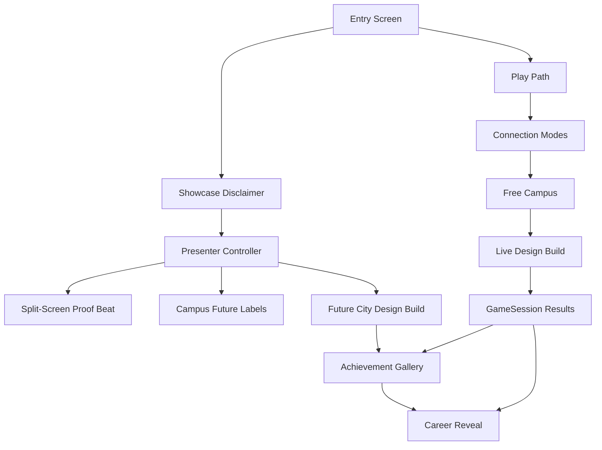

# Demo Wow Showcase Implementation Plan

## Summary

Build a reliable `Showcase` path for Career Quest Campus that demonstrates multiplayer promise, career discovery, Future City Design Build, Achievement Gallery, and Architect + AI Engineer co-lead reveal in under three minutes, while preserving `Play` as the honest free-campus path.

---

## Problem Frame

The current game plan is strong but demo-risky: the reveal payoff can be blocked by late mini-game scope, and the evaluator may not immediately see why the project is multiplayer, creative, and expandable. This plan adds a curated Showcase layer and the supporting live systems needed to make the project feel polished fast without weakening the existing privacy or multiplayer proof requirements.

---

## Requirements

**Entry And Mode Clarity**

- R1. The first screen exposes `Play` and `Showcase`; `Play` enters the free campus path and `Showcase` starts the curated path after a friendly disclaimer.
- R2. Showcase transparency is front-loaded: the child-facing Gallery and Reveal remain immersive, while seeded/live source belongs in debug or QA evidence.

**Showcase Path**

- R3. Showcase reaches Connection Screen -> Two-Client Proof -> Campus -> Future City Design Build -> Achievement Gallery -> Reveal in under three minutes.
- R4. Within the first 60 seconds, Showcase makes multiplayer, Career DNA / badges, and larger-campus promise obvious.
- R5. Showcase may seed route, results, badges, camera beats, and reveal timing to guarantee the best presentation.
- R6. Showcase may use a split-screen/shared-input two-player proof, but QA evidence must separately prove actual Netcode host/client behavior.

**Live Play And Networking**

- R7. The normal `Play` path supports the already-locked connection modes: `Host P1`, `Join Localhost as P2`, `Join LAN by IP`, and `Solo Fallback`.
- R8. Every mini-game remains single-player optional; solo and fallback play support normal keyboard + mouse controls, including mouse-first interactions where the activity naturally uses pointing or placement.
- R9. Same-computer testing supports split controls for two local clients, and LAN join remains attempted/manual-IP but non-blocking unless tested and documented.
- R10. Live networked campus movement uses Netcode/Transport and can be verified by two clients seeing each other move.

**Future City, Gallery, And Reveal**

- R11. Future City Design Build uses clinic, court, studio, lab, and art-tower pieces and visibly rewards accepted contributions.
- R12. The implementation aims for three themed mini-games: Future City Design Build first, then Health Hero Clinic and Logic Court if time allows without risking the core demo.
- R13. Achievement Gallery replaces a plain report-style Passport payoff for Showcase and can plan for all three mini-game badges, with fallback to implemented-only badges near ship.
- R14. Career Reveal unlocks after one mini-game or Showcase-equivalent result; additional unique results improve confidence.
- R15. Showcase reveal presents Architect + AI Engineer co-leads through a Creative Technical Builder profile with Building, Spatial Thinking, Creativity, Reasoning, and Collaboration as the strongest traits.
- R16. AI Engineer copy frames the path as Future Problem Solver: using logic and creativity to solve problems people care about.

**Campus Promise And Privacy**

- R17. Campus includes non-playable future labels such as Space Lab, Music Studio, Green Energy Center, Robotics Garage, and Community Kitchen when they fit cleanly.
- R18. The build adds no accounts, saved profiles, child persistence, analytics, telemetry, or chat.

---

## Key Technical Decisions

- **One persistent Unity scene.** Keep the existing P0 architecture: connection, campus, activities, gallery, and reveal live as states inside one scene to avoid Netcode scene-transition risk.
- **Separate live mode from Showcase mode.** `Play` and `Showcase` share as much presentation and scoring code as practical, but Showcase is allowed to drive seeded state and scripted timing.
- **Live proof stays real.** Showcase's split-screen/shared-input proof is for reliable presentation only; Netcode host/client proof remains a QA gate.
- **UGUI first.** Use Unity UI / UGUI for the first screen, disclaimer, Gallery, Reveal, and debug overlay because the package is installed and it is faster to build/test than a custom UI stack.
- **Data-driven demo fixtures.** Use small local config/assets for careers, traits, badges, future labels, and seeded Showcase results so the reveal is explainable and easy to adjust.
- **Server-authoritative gameplay where networked.** Live multiplayer movement and Design Build actions should use host authority for accepted state, matching `docs/architecture.md`.
- **Use current Netcode RPC style.** Prefer Netcode's `[Rpc(...)]` API over legacy `[ServerRpc]` / `[ClientRpc]` attributes unless implementation discovery proves a local compatibility reason.
- **Generated Unity assets via editor tooling when possible.** Prefer editor/bootstrap scripts or Unity-created assets over hand-editing scene YAML during implementation.

---

## High-Level Technical Design

The `GameSession` layer owns mode, player labels, best results, Career DNA totals, badge state, reveal readiness, and debug metadata. Showcase can write seeded results through the same session interface that live mini-games use, with a debug-only source marker. Live networked flows use Netcode and Unity Transport; Showcase proof can instantiate local simulated players without requiring a second process.

---

## Implementation Units

### U1. Unity Scene And App State Foundation

- **Goal:** Establish the tracked Unity project structure for one persistent game scene and shared app/session state.
- **Create:**
  - `Assets/_CareerQuest/Scenes/CareerQuestCampus.unity`
  - `Assets/_CareerQuest/Scripts/Core/GameSession.cs`
  - `Assets/_CareerQuest/Scripts/Core/AppMode.cs`
  - `Assets/_CareerQuest/Scripts/Core/MiniGameResult.cs`
  - `Assets/_CareerQuest/Scripts/Core/CareerDnaProfile.cs`
  - `Assets/_CareerQuest/Scripts/Config/CareerConfig.cs`
  - `Assets/_CareerQuest/Tests/EditMode/GameSessionTests.cs`
- **Modify:**
  - `ProjectSettings/EditorBuildSettings.asset`
- **Patterns to follow:** Current repo keeps Unity at root and tracks `Assets/`, `Packages/`, and `ProjectSettings/`. Continue one-scene P0 architecture from `docs/architecture.md`.
- **Test scenarios:**
  - New `GameSession` starts in free/play-safe default state.
  - One result unlocks reveal with lower confidence.
  - Additional unique best results improve confidence without replay inflation.
  - Seeded Showcase result can be marked in debug metadata without appearing in normal UI state.
- **Verification:** Unity batchmode compile succeeds; EditMode tests for session/scoring pass.

### U2. Entry Screen, Play Path, And Showcase Disclaimer

- **Goal:** Add the first screen with `Play` and `Showcase`, plus the friendly Showcase disclaimer modal.
- **Create:**
  - `Assets/_CareerQuest/Scripts/UI/EntryScreenController.cs`
  - `Assets/_CareerQuest/Scripts/UI/ShowcaseDisclaimerController.cs`
  - `Assets/_CareerQuest/Tests/PlayMode/EntryFlowTests.cs`
- **Modify:**
  - `Assets/_CareerQuest/Scenes/CareerQuestCampus.unity`
- **Patterns to follow:** Use simple UGUI buttons/text fields. Avoid in-app instructional paragraphs beyond necessary labels and disclaimer copy.
- **Test scenarios:**
  - `Play` enters the free campus state without seeded Showcase data.
  - `Showcase` opens the disclaimer before starting.
  - Accepting the disclaimer starts Showcase mode.
  - Cancel/back returns to the entry screen.
- **Verification:** PlayMode test or scripted scene smoke confirms the two buttons route to distinct modes.

### U3. Live Connection Modes And Networked Campus Avatar

- **Goal:** Implement the real multiplayer proof path for `Host P1`, `Join Localhost as P2`, `Join LAN by IP`, and `Solo Fallback`.
- **Create:**
  - `Assets/_CareerQuest/Scripts/Networking/NetworkBootstrap.cs`
  - `Assets/_CareerQuest/Scripts/Networking/ConnectionMode.cs`
  - `Assets/_CareerQuest/Scripts/Networking/PlayerAvatarNetwork.cs`
  - `Assets/_CareerQuest/Scripts/Input/PlayerControlPreset.cs`
  - `Assets/_CareerQuest/Scripts/Input/PlayerInputRouter.cs`
  - `Assets/_CareerQuest/Prefabs/PlayerAvatar.prefab`
  - `Assets/_CareerQuest/Tests/PlayMode/ConnectionModeTests.cs`
- **Modify:**
  - `Assets/DefaultNetworkPrefabs.asset`
  - `Assets/_CareerQuest/Scenes/CareerQuestCampus.unity`
  - `docs/demo-checklist.md`
  - `docs/qa/README.md`
- **Patterns to follow:** Use `Unity.Netcode`, `Unity.Netcode.Components`, and `Unity.Netcode.Transports.UTP`. Installed package research confirms `UnityTransport.SetConnectionData(string ipv4Address, ushort port, string listenAddress = null)`, `NetworkManager.StartHost()`, and `NetworkManager.StartClient()` are available. The player prefab must have one root `NetworkObject`, no nested `NetworkObject`s, and be registered in `NetworkConfig.Prefabs` / the NetworkManager prefab list.
- **Test scenarios:**
  - Host configures transport for local listening and starts successfully.
  - Localhost client configures `127.0.0.1` and attempts join.
  - LAN host can bind with listen address `0.0.0.0`, while LAN clients use the host's visible LAN IP; this path can be marked experimental if not tested.
  - P1/P2 control presets are visible and distinct.
  - Solo Fallback uses normal keyboard + mouse controls instead of split-keyboard controls.
  - Two networked avatars can move independently through host-authoritative or host-validated state.
- **Verification:** Same-computer manual smoke is documented; Unity compile succeeds; QA template/checklist no longer claims reveal requires two games.

### U4. Showcase Presenter And Split-Screen Proof

- **Goal:** Build Presenter Mode that can run a reliable scripted Showcase sequence with shared-input local proof.
- **Create:**
  - `Assets/_CareerQuest/Scripts/Showcase/ShowcasePresenter.cs`
  - `Assets/_CareerQuest/Scripts/Showcase/ShowcaseStep.cs`
  - `Assets/_CareerQuest/Scripts/Showcase/ShowcaseSimulatedPlayer.cs`
  - `Assets/_CareerQuest/Scripts/Showcase/FutureCampusLabel.cs`
  - `Assets/_CareerQuest/Tests/EditMode/ShowcaseSequenceTests.cs`
- **Modify:**
  - `Assets/_CareerQuest/Scenes/CareerQuestCampus.unity`
- **Patterns to follow:** Showcase can use local simulated players, but should reuse `PlayerInputRouter`/action concepts from live play where practical.
- **Test scenarios:**
  - Showcase sequence contains the required beats in order.
  - First-minute sequence includes multiplayer proof, Career DNA/badge hook, and future-campus labels.
  - Presenter can advance automatically without user input.
  - Showcase path does not alter normal `Play` defaults.
- **Verification:** Automated test validates sequence metadata; manual scene smoke reaches the first three beats.

### U5. Future City Design Build Slice

- **Goal:** Add the Future City Model activity with accepted placement feedback for live and Showcase paths.
- **Create:**
  - `Assets/_CareerQuest/Scripts/Activities/DesignBuild/DesignBuildController.cs`
  - `Assets/_CareerQuest/Scripts/Activities/DesignBuild/BuildPiece.cs`
  - `Assets/_CareerQuest/Scripts/Activities/DesignBuild/BuildSlot.cs`
  - `Assets/_CareerQuest/Scripts/Activities/DesignBuild/FutureCityBlueprint.cs`
  - `Assets/_CareerQuest/Tests/EditMode/DesignBuildRulesTests.cs`
  - `Assets/_CareerQuest/Tests/PlayMode/DesignBuildFlowTests.cs`
- **Modify:**
  - `Assets/_CareerQuest/Scenes/CareerQuestCampus.unity`
- **Patterns to follow:** Live networked actions should submit discrete place/confirm requests to host authority using current Netcode RPC patterns. Showcase can script or seed placement timing if needed.
- **Test scenarios:**
  - Correct pieces match intended slots.
  - Duplicate placement is rejected gently and does not apply twice.
  - Completion emits one `MiniGameResult`.
  - Result contributes Building, Spatial Thinking, Creativity, Reasoning, and Collaboration.
  - Showcase can play the Future City Model beat without live network dependency.
- **Verification:** Rule tests pass; manual smoke shows accepted-placement feedback; result feeds `GameSession`.

### U6. Health Hero And Logic Court Optional Slices

- **Goal:** Preserve the three-themed-mini-game ambition by adding Health Hero Clinic and Logic Court as scoped optional slices after Design Build is stable.
- **Create:**
  - `Assets/_CareerQuest/Scripts/Activities/HealthHero/HealthHeroController.cs`
  - `Assets/_CareerQuest/Scripts/Activities/HealthHero/HealthHeroCase.cs`
  - `Assets/_CareerQuest/Scripts/Activities/LogicCourt/LogicCourtController.cs`
  - `Assets/_CareerQuest/Scripts/Activities/LogicCourt/EvidenceCard.cs`
  - `Assets/_CareerQuest/Tests/EditMode/HealthHeroRulesTests.cs`
  - `Assets/_CareerQuest/Tests/EditMode/LogicCourtRulesTests.cs`
  - `Assets/_CareerQuest/Tests/PlayMode/OptionalMiniGameFlowTests.cs`
- **Modify:**
  - `Assets/_CareerQuest/Scenes/CareerQuestCampus.unity`
  - `Assets/_CareerQuest/Scripts/Config/CareerConfig.cs`
- **Patterns to follow:** Both optional activities must emit the same `MiniGameResult` contract as Design Build. They should support solo mouse interactions first and only add live network synchronization where it can reuse the existing host-authoritative request/result pattern without destabilizing the demo.
- **Test scenarios:**
  - Health Hero completion emits one result with Helping, Science, Focus, and Communication contributions.
  - Logic Court completion emits one result with Reasoning, Communication, Focus, and Leadership contributions.
  - Each optional activity can be entered and completed in Solo Fallback with normal keyboard + mouse controls.
  - Replaying an optional activity updates best result without inflating Career DNA.
  - If an optional activity is not shippable, its Showcase badge can be hidden or shown only as a planned badge without implying playable scope.
- **Verification:** Optional activity rule tests pass when included; if deferred, docs and Showcase configuration clearly use implemented-only fallback badges.

### U7. Achievement Gallery And Career Reveal

- **Goal:** Build the Showcase payoff: badge gallery, one-game reveal unlock, Architect + AI Engineer co-lead reveal, and confidence behavior.
- **Create:**
  - `Assets/_CareerQuest/Scripts/UI/AchievementGalleryController.cs`
  - `Assets/_CareerQuest/Scripts/UI/CareerRevealController.cs`
  - `Assets/_CareerQuest/Scripts/Config/ShowcaseSeedConfig.cs`
  - `Assets/_CareerQuest/Tests/EditMode/CareerRevealTests.cs`
  - `Assets/_CareerQuest/Tests/PlayMode/ShowcaseRevealFlowTests.cs`
- **Modify:**
  - `Assets/_CareerQuest/Scenes/CareerQuestCampus.unity`
  - `docs/architecture.md`
  - `README.md`
- **Patterns to follow:** Keep reveal language strength-based from `docs/architecture.md`. Do not show seeded/live labels in normal Gallery UI.
- **Test scenarios:**
  - One unique result unlocks reveal with `Good match`.
  - Additional unique results raise confidence appropriately.
  - Seeded Creative Technical Builder profile produces Architect + AI Engineer co-leads.
  - AI Engineer explanation uses Future Problem Solver framing.
  - Gallery can show all planned badges or implemented-only fallback based on configuration.
- **Verification:** EditMode scoring/reveal tests pass; Showcase reaches Gallery -> Reveal under three minutes in manual smoke.

### U8. Debug, QA, And Documentation Alignment

- **Goal:** Make the new Showcase path auditable and keep docs aligned with the one-game reveal gate.
- **Create:**
  - `Assets/_CareerQuest/Scripts/UI/DemoDebugOverlay.cs`
  - `Assets/_CareerQuest/Tests/PlayMode/DebugOverlayTests.cs`
  - `docs/qa/YYYY-MM-DD-showcase-smoke.md` during execution after a real smoke pass
- **Modify:**
  - `README.md`
  - `docs/architecture.md`
  - `docs/demo-checklist.md`
  - `docs/qa/README.md`
- **Patterns to follow:** QA docs already require same-computer proof and note source metadata belongs in Passport/debug rather than ceremony.
- **Test scenarios:**
  - Debug overlay exposes mode, seeded/live source, connection status, player count, current Showcase step, and last result.
  - Demo checklist reflects one-game reveal unlock and Showcase route.
  - QA template separates Showcase simulation from actual Netcode two-client proof.
  - README names `Play` vs `Showcase` and keeps privacy constraints explicit.
- **Verification:** Documentation has no remaining legacy two-game reveal gate; Unity batchmode open/compile succeeds; final smoke evidence exists before shipping.

---

## Acceptance Examples

- AE1. **Covers R1-R2.** Given the app opens, when the evaluator presses `Showcase`, then a friendly guided-tour disclaimer appears before any seeded state is shown.
- AE2. **Covers R3-R6.** Given Showcase starts, when the first minute completes, then the evaluator has seen two-player proof, Career DNA/badge meaning, and future-campus promise.
- AE3. **Covers R7-R10.** Given two local clients are run for QA, when one hosts and the other joins localhost, then both avatars can move and observe each other while solo mode remains available with normal keyboard + mouse controls.
- AE4. **Covers R11-R13.** Given Future City Design Build accepts a piece, when the placement completes, then both live and Showcase presentations can show clear accepted-placement feedback and the Gallery can represent planned or implemented mini-game badges honestly.
- AE5. **Covers R14-R16.** Given only one result exists, when reveal is opened, then it unlocks with lower confidence and does not require a second live mini-game.
- AE6. **Covers R17-R18.** Given the build is smoke-tested, when QA docs are reviewed, then they distinguish future labels, Showcase simulation, real networking proof, and privacy boundaries.

---

## System-Wide Impact

- **Reveal semantics change.** Existing docs and tests must move from "two games unlock reveal" to "one game unlocks; more improves confidence."
- **Mini-game breadth stays flexible.** Design Build is the protected first complete activity; Health Hero and Logic Court are planned themed additions that should ship only if they do not threaten the Showcase path.
- **Demo semantics split.** Showcase is now an explicit curated mode, while `Play` remains normal gameplay. Future work must avoid mixing seeded state into normal play.
- **QA burden increases.** The project must prove both a polished Showcase and real two-client networking, because Showcase simulation is intentionally not the only multiplayer proof.
- **Privacy remains strict.** No implementation unit should add persistence, accounts, chat, analytics, telemetry, or saved child profiles.

---

## Risks & Dependencies

- **Unity asset generation risk:** Scene and prefab assets are easy to dirty or miswire. Mitigate by using editor/bootstrap scripts where possible and verifying with batchmode.
- **Netcode setup risk:** Player prefab registration and transport configuration can fail silently in UI-only work. Mitigate by testing host/client paths early before deeper Showcase polish.
- **Showcase honesty risk:** Seeded state could feel misleading if not framed. Mitigate with the pre-launch disclaimer and debug/QA metadata.
- **Scope pressure risk:** Future labels, optional mini-games, and seeded badges can sprawl. Mitigate by treating labels as visual-only, keeping Design Build first, and allowing implemented-only badge fallback.
- **Testing time risk:** Two-client manual proof cannot be fully replaced by unit tests. Mitigate by documenting manual QA evidence as part of U8.

---

## Documentation / Operational Notes

- Keep `docs/demo-checklist.md` aligned around Showcase as the evaluator route, `Play` as free campus, and live host/client as required QA proof.
- Keep `docs/qa/README.md` aligned with Showcase-specific checks, Play/free-campus checks, privacy checks, and actual two-client networking proof.
- Keep `README.md` concise: explain `Play`, `Showcase`, privacy constraints, and Windows build as the multiplayer proof.
- Record dated QA evidence after the first successful Showcase smoke and again after the first actual two-client smoke.

---

## Sources / Research

- `docs/brainstorms/2026-06-09-demo-wow-showcase-requirements.md` is the origin requirements document.
- `README.md` defines the locked Unity scope, privacy stance, and existing verification targets.
- `docs/architecture.md` defines one-scene P0 architecture, host-authoritative multiplayer, mini-game result contract, Passport/Reveal behavior, and debug overlay expectations.
- `docs/demo-checklist.md` defines the Showcase evaluator path, Play free-campus path, live multiplayer proof path, and one-game reveal check.
- `docs/qa/README.md` defines smoke evidence requirements for Showcase, Play, privacy, local host/client, LAN, solo fallback, and reveal confidence.
- `Packages/manifest.json` and `Packages/packages-lock.json` pin Netcode for GameObjects `2.11.2`, Unity Transport `2.7.2`, UGUI `2.0.0`, and Unity Test Framework `1.6.0`.
- `Library/PackageCache/com.unity.netcode.gameobjects@beeaefb722f7/Runtime/Transports/UTP/UnityTransport.cs` confirms `UnityTransport.SetConnectionData(...)`, default localhost data, and listen-address behavior for localhost/LAN setup.
- `Library/PackageCache/com.unity.netcode.gameobjects@beeaefb722f7/Runtime/Core/NetworkManager.cs` confirms `StartHost()`, `StartClient()`, and required `NetworkConfig.NetworkTransport` setup.
- `Library/PackageCache/com.unity.netcode.gameobjects@beeaefb722f7/Runtime/Core/NetworkObject.cs` confirms player-object spawn APIs and network-prefab constraints.
- `Library/PackageCache/com.unity.netcode.gameobjects@beeaefb722f7/Runtime/Messaging/RpcAttributes.cs` confirms Netcode `2.11.2` supports the current `[Rpc(...)]` API while legacy RPC attributes remain available.
