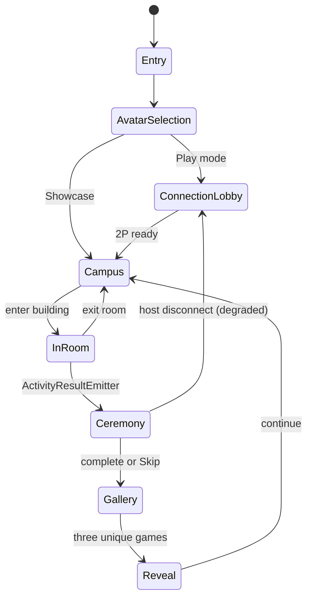
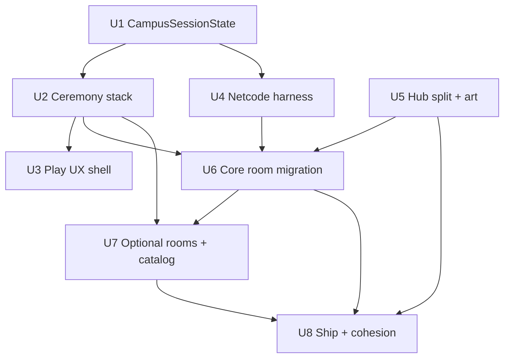

# feat: Career Quest Approach B — Full Loop Parity

## Summary

This plan implements **CEO Approach B** for Career Quest Campus: one persistent scene, local two-player host-authoritative play, ceremony on every room completion, and full loop parity from avatar selection through gallery and career reveal. Work is sequenced in four waves — spine and harness first (Wave 1), core room migration (Wave 2), playable optional hub rooms plus catalog (Wave 3), then ShipLadder and hard zero-fallback gates (Wave 4). Implementation extends existing orchestrators (`CareerQuestApp`, `GameSession`, `SceneFlowRouter`) rather than replacing them. (see origin: `docs/brainstorms/2026-06-09-career-quest-full-vision-requirements.md`; CEO locks: `docs/plans/2026-06-10-career-quest-full-vision-ceo-plan.md`; eng review: `docs/plans/2026-06-10-career-quest-eng-review-handoff.md`)

---

## Problem Frame

Career Quest Campus already has three working activity rooms, a hub, avatar selection, and partial Netcode — but Play mode still shows evaluator shortcuts, rooms jump straight to gallery without ceremony, there is no host-authoritative session spine for two players, and ship readiness lacks a hard gate against placeholder art. The full-vision requirements define the kid-facing loop; this plan closes the engineering gaps identified in the 2026-06-10 engineering review.

---

## Requirements

- R1. Play path hides campus action bar; Showcase retains evaluator affordances (CEO Q1–Q5).
- R2. Every core and optional room completion routes through ceremony before gallery (CEO Q6; origin R6, R7).
- R3. Ceremony supports Skip after ~3 seconds; total budget ~12s (CEO S11-2).
- R4. Local 2P: host-authoritative `CampusSessionState` mirrors local `GameSession` (CEO S1-B, S2-A).
- R5. P2 cannot join while host is inside an activity room; host disconnect mid-ceremony degrades gracefully (CEO S2-C).
- R6. `InstructionStrip` provides kid-facing guidance in Play; absent in Showcase where inappropriate (CEO T3).
- R7. Core rooms (Design Build, Health Hero, Logic Court) on `ActivityRoomController` + shared chrome (CEO Q10).
- R8. Optional hub buildings are **playable** activities with `CareerQuestCatalog` metadata — not labels-only (user-confirmed Wave 3).
- R9. Tiered art warmup: hub boot + room veil on enter (CEO S7-3).
- R10. Wave 2 blocked until Wave 1 ceremony PlayMode row is green (eng review merge gate).
- R11. ShipLadder + EditMode hard-fail on `SpriteFallbackFactory` in Play scenes (CEO S6-2).
- R12. Visual and UX choices follow `DESIGN.md` (Future Workshop Diorama + Junior Quest UX).

**Origin actors:** A1 (Player 1 / host), A2 (Player 2 / client), A3 (Showcase evaluator), A4 (Kid player in Play mode)

**Origin flows:** F1 (Play loop: avatar → campus → room → ceremony → gallery → reveal), F2 (Showcase demo path), F3 (2P connection and co-presence), F4 (Optional room discovery), F5 (Career reveal after three unique games)

**Origin acceptance examples:** AE1 (Play hides action bar), AE2 (Ceremony before gallery), AE3 (Skip ceremony at 3s), AE4 (2P co-enter room, mirrored results), AE5 (Reveal locked until three unique career games), AE6 (Host disconnect handling), AE7 (Reject late join in-room), AE8 (Instruction strip visible in Play), AE9 (Optional rooms playable)

---

## Scope Boundaries

### Deferred for later

(Carried verbatim from origin — product/version sequencing.)

- Living Campus expansion (ambient NPCs, day/night cycles, broader world simulation)
- Netcode scene split per building (persistent single scene for Week7)
- B-narrow late join with hub catch-up snapshot (lobby-only join for first playable)
- Cloud relay / WebGL build targets
- Mid-room full state snapshot for late joiners

### Outside this product's identity

(Carried verbatim from origin — positioning rejection.)

- Generic LMS / gradebook integration
- Real-time multiplayer beyond local LAN 2P
- LLM-driven tutoring or open-ended chat companion
- Adult career assessment or psychometric scoring products

### Deferred to Follow-Up Work

- `DemoDebugOverlay` full removal — gate with dev harness only in Wave 1; delete in follow-up if desired
- PlayMode test migration away from `BeginPlay()` shortcuts — addressed in U8 but legacy test debt may remain for non-spine tests
- GitHub Actions CI matrix — ShipLadder runs locally via Editor menu until CI wiring is requested
- Documentation refresh in `docs/architecture.md` for ceremony routing — update in Wave 4 doc pass

---

## Context & Research

### Relevant Code and Patterns

- App orchestrator: `Assets/_CareerQuest/Scripts/UI/CareerQuestApp.cs` — routing, `ShowCampus()`, room entry via `GetComponent<T>() ?? AddComponent<T>()`
- Session + routing: `Assets/_CareerQuest/Scripts/Core/GameSession.cs`, `Assets/_CareerQuest/Scripts/Core/SceneFlowRouter.cs`
- Activity base (unused by rooms today): `Assets/_CareerQuest/Scripts/Activities/Shared/ActivityRoomController.cs`, `ActivityResultEmitter`, `ActivityLifecycle`
- Room controllers: `DesignBuildController`, `HealthHeroController`, `LogicCourtController` — complete via `ShowGallery()` directly
- Hub/world: `Assets/_CareerQuest/Scripts/World/CampusWorldController.cs` (~531 LOC), `PlayableHubController`, `PlayerAvatarController`
- Netcode: `Assets/_CareerQuest/Scripts/Networking/NetworkBootstrap.cs`, `DesignBuildNetworkState.cs`, `PlayerAvatarNetwork`
- UI builders: `Assets/_CareerQuest/Scripts/UI/UiBuilder.cs`, gallery/reveal/entry flows
- Tests: `Assets/_CareerQuest/Tests/EditMode/`, `Assets/_CareerQuest/Tests/PlayMode/` (~20 files)
- Build: `Assets/_CareerQuest/Editor/CareerQuestBuild.cs`
- Design contract: `DESIGN.md`, `docs/art-direction.md`

### Institutional Learnings

- No entries in `docs/solutions/` for this repo.

### External References

- External research skipped — CEO plan, eng review, and local patterns sufficient (Unity 6000.4.10f1, Netcode 2.11.2).

---

## Key Technical Decisions

- **Spine-first Wave 1:** Build `CampusSessionState`, ceremony stack, and `NetcodePlayModeHarness` before room migration or optional content (see eng review Section 1).
- **Extend, don't replace:** Keep `CareerQuestApp` as façade; ceremony and session live in dedicated types (CEO S5-1).
- **Host mirror:** `CampusSessionState` NetworkBehaviour mirrors host's `GameSession` — no second session model (CEO S1-B).
- **Ceremony route:** `ActivityResultEmitter` → `CeremonyController` → `FeedbackController` → `SceneFlowRouter` gallery; add `ActivityPhase.Ceremony` to lifecycle enum.
- **Room migration pattern:** Wave 2 wraps existing controllers as thin adapters on `ActivityRoomController`; remove duplicate `ShowGallery()` completion paths per room in same unit.
- **Hub split:** Decompose `CampusWorldController` into focused child controllers in Wave 1 (CEO S1-A).
- **Wave 3 scope:** All optional buildings get minimal playable activities + catalog entries (user confirmed 2026-06-10).
- **Persistent scene:** No Netcode scene split in Week7 (TODOS P3).

---

## Open Questions

### Resolved During Planning

- **Optional rooms in Wave 3 — playable or catalog-only?** Playable with catalog metadata (user confirmed in Phase 5.1.5).
- **Wave 2 start gate?** Block until Wave 1 PlayMode spine row passes (eng review).

### Deferred to Implementation

- Exact ceremony sub-phase timing curves and particle budget per `DESIGN.md` — tune in PlayMode with Skip UX.
- Final optional-room activity mechanics per building — minimal vertical slice acceptable if catalog + ceremony + completion path exist.
- Precise RPC batching intervals on `CampusSessionState` — profile during harness development.

---

## High-Level Technical Design

> *This illustrates the intended approach and is directional guidance for review, not implementation specification. The implementing agent should treat it as context, not code to reproduce.*



**Wave dependency graph:**



---

## Output Structure

```
Assets/_CareerQuest/Scripts/
├── Core/
│   ├── CampusSessionState.cs          (new)
│   └── ActivityPhase.cs             (extend enum)
├── Activities/
│   ├── Shared/
│   │   ├── ActivityRoomController.cs (extend)
│   │   ├── ActivityRoomChrome.cs     (new)
│   │   ├── CeremonyController.cs     (new)
│   │   ├── FeedbackController.cs     (new)
│   │   └── AudioCueCatalog.cs        (new)
│   └── [OptionalBuilding]/           (Wave 3 — per building)
├── UI/
│   └── InstructionStrip.cs           (new)
├── World/
│   ├── CampusWorldController.cs      (slim coordinator)
│   ├── PlayableHubController.cs
│   ├── HubBootController.cs          (new, split)
│   ├── BuildingEntranceController.cs (new, split)
│   └── RoomVeilController.cs         (new, split)
├── Networking/
│   └── NetcodePlayModeHarness.cs     (new, test support)
├── Catalog/
│   └── CareerQuestCatalog.cs         (new, Wave 3)
Assets/_CareerQuest/Tests/
├── PlayMode/
│   ├── CeremonyFlowPlayModeTests.cs  (new)
│   └── NetcodePlayModeHarnessTests.cs (new)
Assets/_CareerQuest/Editor/
└── ShipLadder.cs                     (new, Wave 4)
```

---

## Implementation Units

### U1. CampusSessionState and host session mirror

**Goal:** Introduce host-authoritative networked session state that mirrors local `GameSession` for 2P Play, including activity phase, room identity, and player readiness flags.

**Requirements:** R4, R5; Covers F3; origin R15–R18

**Dependencies:** None

**Files:**
- Create: `Assets/_CareerQuest/Scripts/Core/CampusSessionState.cs`
- Modify: `Assets/_CareerQuest/Scripts/Core/GameSession.cs`
- Modify: `Assets/_CareerQuest/Scripts/Networking/NetworkBootstrap.cs`
- Modify: `Assets/_CareerQuest/Scripts/UI/CareerQuestApp.cs`
- Test: `Assets/_CareerQuest/Tests/PlayMode/CampusSessionStatePlayModeTests.cs`

**Approach:**
- Add `CampusSessionState` as NetworkBehaviour owned by host; sync phase (Hub, InRoom, Ceremony, Gallery), current room id, P1/P2 presence, and join-lock when host is InRoom.
- Host writes from `GameSession`; clients read-only except local input forwarded through existing commands.
- Reject P2 join attempts when phase is InRoom or Ceremony (CEO S2-A).

**Execution note:** Add EditMode tests for enum transitions and join-lock rules before wiring Netcode.

**Patterns to follow:**
- `DesignBuildNetworkState.cs` for NetworkVariable patterns
- `GameSession.cs` for local DNA and progress fields

**Test scenarios:**
- Happy path: host starts session, client connects in lobby, both transition to campus with matching phase Hub.
- Edge case: host enters room — join-lock flag set; client join request rejected with user-visible reason.
- Error path: host disconnect — clients receive disconnect state and return to connection UI without stuck overlay.
- Integration: `GameSession` progress increment on host propagates to client read model for gallery/reveal counts.

**Verification:**
- EditMode + PlayMode tests pass for session mirror and join-lock.
- Manual: host + client in Editor Multiplayer Play Mode show consistent phase labels in dev HUD.

---

### U2. Ceremony stack (CeremonyController, FeedbackController, AudioCueCatalog)

**Goal:** Insert mandatory ceremony between room completion and gallery for all activities; support Skip after ~3s and ~12s total budget.

**Requirements:** R2, R3; Covers AE2, AE3; origin R6, R7

**Dependencies:** U1

**Files:**
- Create: `Assets/_CareerQuest/Scripts/Activities/Shared/CeremonyController.cs`
- Create: `Assets/_CareerQuest/Scripts/Activities/Shared/FeedbackController.cs`
- Create: `Assets/_CareerQuest/Scripts/Activities/Shared/AudioCueCatalog.cs`
- Modify: `Assets/_CareerQuest/Scripts/Activities/Shared/ActivityLifecycle.cs` (add Ceremony phase)
- Modify: `Assets/_CareerQuest/Scripts/Core/SceneFlowRouter.cs`
- Modify: `Assets/_CareerQuest/Scripts/UI/CareerQuestApp.cs`
- Test: `Assets/_CareerQuest/Tests/PlayMode/CeremonyFlowPlayModeTests.cs`

**Approach:**
- `ActivityResultEmitter` raises completion → `CeremonyController` runs sub-phases (celebration, feedback hook, transition) → `SceneFlowRouter.ShowGallery()` only after ceremony completes or Skip.
- `FeedbackController` surfaces room-specific copy from `ActivityFeedback` / DESIGN tokens.
- `AudioCueCatalog` maps ceremony/room cues to Resources clips; no blocking on missing clip in dev, but Wave 4 gate applies to Play scenes.
- Skip button visible after 3s; skipping jumps to gallery-ready state.

**Execution note:** Start with failing PlayMode test: complete mock room → assert gallery NOT shown until ceremony completes.

**Patterns to follow:**
- `SceneFlowRouter` routing patterns
- `ActivityResultEmitter` event contract
- Motion/spacing from `DESIGN.md` ceremony section

**Test scenarios:**
- Covers AE2. Happy path: room emits result → ceremony UI visible → gallery opens only after ceremony end.
- Covers AE3. Edge case: wait 3s → Skip enabled → tap Skip → gallery opens without waiting full 12s.
- Edge case: ceremony in progress — action bar and room re-entry blocked.
- Error path: host disconnect mid-ceremony — both players see degraded message and safe return to connection or campus (no soft-lock).
- Integration: ceremony respects `CampusSessionState` phase Ceremony; gallery blocked while phase ≠ complete.

**Verification:**
- **Wave 1 merge gate:** PlayMode row avatar → campus → one room → ceremony → gallery passes.
- No room controller calls `ShowGallery()` directly without ceremony hook (grep audit in verification).

---

### U3. Play UX — hide action bar and InstructionStrip

**Goal:** Play mode hides campus action bar shortcuts; add kid-facing `InstructionStrip` for contextual guidance per DESIGN.md.

**Requirements:** R1, R6; Covers AE1, AE8

**Dependencies:** U1, U2 (session phase for strip content; ceremony phase gating)

**Files:**
- Create: `Assets/_CareerQuest/Scripts/UI/InstructionStrip.cs`
- Modify: `Assets/_CareerQuest/Scripts/UI/CareerQuestApp.cs` (`ShowCampus`, mode flags)
- Modify: `Assets/_CareerQuest/Scripts/UI/UiBuilder.cs`
- Test: `Assets/_CareerQuest/Tests/PlayMode/PlayModeUxPlayModeTests.cs`

**Approach:**
- Branch `ShowCampus()` on Play vs Showcase: omit `CampusActionBar` construction in Play.
- `InstructionStrip` binds to `CampusSessionState` / local phase for copy (hub, in-room, ceremony hints).
- Showcase path unchanged for evaluator demos.

**Patterns to follow:**
- Existing entry/gallery UI from `UiBuilder`
- Typography and color tokens from `DESIGN.md`

**Test scenarios:**
- Covers AE1. Happy path: `BeginPlay` or full avatar path → campus loads → no action bar nodes in hierarchy.
- Covers AE8. Happy path: InstructionStrip visible on campus with hub copy; updates on room enter.
- Edge case: Showcase mode → action bar present; strip behavior per showcase rules.
- Integration: strip hidden or replaced during ceremony sub-phases without overlapping Skip control.

**Verification:**
- PlayMode assertion on action bar absence and strip presence.
- Visual spot-check against `DESIGN.md` spacing hierarchy.

---

### U4. NetcodePlayModeHarness (2P matrix)

**Goal:** Reusable PlayMode harness spawning host + client for LAN 2P scenarios: co-enter room, mirrored results, disconnect, join rejection.

**Requirements:** R4, R5; Covers AE4, AE6, AE7; origin networking requirements

**Dependencies:** U1

**Files:**
- Create: `Assets/_CareerQuest/Scripts/Networking/NetcodePlayModeHarness.cs`
- Create: `Assets/_CareerQuest/Tests/PlayMode/NetcodePlayModeHarnessTests.cs`
- Modify: `Assets/_CareerQuest/Tests/PlayMode/ConnectionPlayModeTests.cs` (align with harness)

**Approach:**
- Static helper: start host, connect client, wait for session sync, expose teardown.
- Matrix rows: lobby join, co-enter building, result mirror, host disconnect mid-room, host disconnect mid-ceremony, P2 join rejected in-room.
- Use Unity Multiplayer Play Mode or programmatic `NetworkManager` setup per existing bootstrap.

**Execution note:** Characterization-first on existing `ConnectionPlayModeTests` before expanding matrix.

**Patterns to follow:**
- `NetworkBootstrap.cs` startup sequence
- Existing PlayMode test fixtures in `Assets/_CareerQuest/Tests/PlayMode/`

**Test scenarios:**
- Covers AE4. Integration: both players enter same room; completion on host mirrors client gallery eligibility.
- Covers AE7. Error path: host in room, client attempts join → rejected with banner/state.
- Covers AE6. Error path: host disconnect during ceremony → client recovery path exercised.
- Happy path: full 2P lobby → campus spawn positions for both avatars.

**Verification:**
- Harness tests green in EditMode/PlayMode CI locally.
- Document harness API in unit verification notes for Wave 2 reuse.

---

### U5. Hub split, tiered warmup, and avatar art batch

**Goal:** Split `CampusWorldController` monolith; implement tiered hub boot + room veil; batch avatar walk/idle sheets per CEO S7-1 and DESIGN.md.

**Requirements:** R9; CEO S1-A, S7-1, S7-3; origin art requirements

**Dependencies:** None (parallel with U1–U4; coordinate `PlayerAvatarController` API with U1)

**Files:**
- Create: `Assets/_CareerQuest/Scripts/World/HubBootController.cs`
- Create: `Assets/_CareerQuest/Scripts/World/BuildingEntranceController.cs`
- Create: `Assets/_CareerQuest/Scripts/World/RoomVeilController.cs`
- Modify: `Assets/_CareerQuest/Scripts/World/CampusWorldController.cs`
- Modify: `Assets/_CareerQuest/Scripts/Hub/PlayerAvatarController.cs`
- Modify: `Assets/_CareerQuest/Resources/CareerQuest/` (art batch)
- Test: `Assets/_CareerQuest/Tests/PlayMode/HubWarmupPlayModeTests.cs`

**Approach:**
- Extract boot, entrances, and veil from monolith; coordinator delegates.
- Hub loads minimal prop set first; room interior veiled until enter transition completes.
- Sync art batch from pipeline into Resources; wire walk/idle on `PlayerAvatarController`.

**Patterns to follow:**
- `AssetCatalog` loading patterns
- `docs/art-direction.md` batch checklist

**Test scenarios:**
- Happy path: campus boot frame time under baseline (smoke assert or logged metric in test).
- Edge case: enter room → veil clears after transition callback.
- Integration: 2P avatars show walk/idle sheets on hub (visual foundation screenshot test optional).

**Verification:**
- `CampusWorldController` LOC materially reduced; child controllers own entrances and veil.
- No regression in existing hub PlayMode movement tests.

---

### U6. Core room migration (DB, HH, LC on ActivityRoomController)

**Goal:** Migrate Design Build, Health Hero, and Logic Court to `ActivityRoomController` + shared `ActivityRoomChrome`; per-room Netcode state; completion via ceremony only.

**Requirements:** R7, R10; CEO Q10, S5-2; Covers AE2

**Dependencies:** U2 (ceremony green), U4 (harness), U5 (hub entrances stable)

**Files:**
- Create: `Assets/_CareerQuest/Scripts/Activities/Shared/ActivityRoomChrome.cs`
- Modify: `Assets/_CareerQuest/Scripts/Activities/Shared/ActivityRoomController.cs`
- Modify: `Assets/_CareerQuest/Scripts/Activities/DesignBuild/DesignBuildController.cs`
- Modify: `Assets/_CareerQuest/Scripts/Activities/HealthHero/HealthHeroController.cs`
- Modify: `Assets/_CareerQuest/Scripts/Activities/LogicCourt/LogicCourtController.cs`
- Create: `Assets/_CareerQuest/Scripts/Networking/HealthHeroNetworkState.cs`
- Create: `Assets/_CareerQuest/Scripts/Networking/LogicCourtNetworkState.cs`
- Modify: `Assets/_CareerQuest/Scripts/Networking/DesignBuildNetworkState.cs`
- Test: extend `DesignBuildPlayModeTests.cs`, `HealthHeroPlayModeTests.cs`, `LogicCourtPlayModeTests.cs`

**Approach:**
- One room per commit PR preference: DB pattern first, then HH, then LC.
- Thin adapter: existing gameplay logic retained; base class owns lifecycle, chrome, result emission.
- Remove direct `ShowGallery()` calls from room completion handlers.
- Add network state siblings following DB pattern.

**Execution note:** Characterization tests on existing room completion before migration each room.

**Patterns to follow:**
- `ActivityRoomController.cs` stub
- `DesignBuildNetworkState.cs`

**Test scenarios:**
- Happy path (each room): enter → complete activity → ceremony → gallery.
- Integration: harness row per room with 2P result mirror.
- Error path: invalid state transition rejected by base lifecycle.
- Edge case: exit room mid-activity returns to hub without gallery leak.

**Verification:**
- Wave 2 done when each core room passes harness row and no direct gallery bypass remains.
- Grep: zero `ShowGallery()` in room controllers except via ceremony/router.

---

### U7. Optional hub rooms (playable) and CareerQuestCatalog

**Goal:** Implement playable optional building activities on the same activity template; central `CareerQuestCatalog` for discovery, badges, and reveal eligibility metadata.

**Requirements:** R8; CEO Wave 3 / S10-1; Covers F4; user-confirmed playable scope

**Dependencies:** U6 (core room pattern proven)

**Files:**
- Create: `Assets/_CareerQuest/Scripts/Catalog/CareerQuestCatalog.cs`
- Create: `Assets/_CareerQuest/Scripts/Activities/[OptionalRoomName]/` (per optional building — minimal playable slice)
- Modify: `Assets/_CareerQuest/Scripts/World/BuildingEntranceController.cs`
- Modify: `Assets/_CareerQuest/Scripts/UI/CareerQuestApp.cs` (routing)
- Test: `Assets/_CareerQuest/Tests/PlayMode/OptionalMiniGameFlowTests.cs` (extend)

**Approach:**
- Catalog ScriptableObject or static registry: room id, display name, career tag, badge art key, playable scene hook.
- Each optional building: minimal win condition + ceremony path + catalog registration — not label-only interactables.
- Reuse `ActivityRoomChrome` and ceremony from U2/U6.

**Patterns to follow:**
- `OptionalMiniGameFlowTests.cs` existing optional flow
- Core room migration from U6

**Test scenarios:**
- Happy path: enter optional building → complete minimal activity → ceremony → gallery; catalog marks completion.
- Covers AE5 support: third **unique** catalog game unlocks reveal eligibility (integrate with existing reveal tests).
- Edge case: optional room enter while 2P — both players subject to same join/lock rules as core rooms.
- Integration: catalog lists all optional rooms; incomplete rooms still enterable in Play.

**Verification:**
- All optional buildings in hub are playable end-to-end, not placeholder panels.
- Catalog drives UI labels and reveal counting without hardcoded room lists in gallery.

---

### U8. ShipLadder, visual cohesion, zero-fallback gate, test hygiene

**Goal:** Wave 4 ship readiness — ShipLadder build menu, visual cohesion pass per DESIGN.md, hard EditMode fail on fallback sprites in Play scenes, fix PlayMode shortcuts that skip avatar gate.

**Requirements:** R11, R12; CEO S6-2, S11-3; eng review Wave 4 gate

**Dependencies:** U2, U6, U7 (feature-complete loop)

**Files:**
- Create: `Assets/_CareerQuest/Editor/ShipLadder.cs`
- Modify: `Assets/_CareerQuest/Editor/CareerQuestBuild.cs`
- Modify: `Assets/_CareerQuest/Tests/EditMode/SpriteFallbackGateEditModeTests.cs` (or create)
- Modify: PlayMode tests using `BeginPlay()` shortcut — align with avatar-first path where spine-critical
- Modify: UI polish targets per DESIGN.md (gallery, reveal, connection, ceremony)
- Test: existing visual-first PlayMode suite

**Approach:**
- ShipLadder: menu item running tests + build + bundle checklist (SubmissionBundle artifacts per CEO Wave 4).
- EditMode gate scans Play/scene prefabs for `SpriteFallbackFactory` usage — fail test fails CI locally.
- Cohesion pass: spacing, typography, room tints per DESIGN.md — no new product scope.
- Replace spine-critical `BeginPlay()` shortcuts with `ShowAvatarSelectionForPlay()` path in tests listed in eng review.

**Patterns to follow:**
- `CareerQuestBuild.cs`
- Existing visual-first PlayMode screenshot tests

**Test scenarios:**
- Happy path: ShipLadder menu completes test suite + Windows build without error.
- Error path: intentional fallback in Play scene → EditMode gate fails (validate gate works).
- Integration: full PlayMode spine row still green after test hygiene changes.

**Verification:**
- Wave 4 done per CEO: ShipLadder exists, zero-fallback hard gate active, visual cohesion checklist signed in PR description.
- Reveal/gallery match DESIGN.md spot-check screenshots.

---

## System-Wide Impact

- **Interaction graph:** `CareerQuestApp` remains entry for all routes; `SceneFlowRouter` gains ceremony branch; room controllers lose direct gallery calls; `CampusSessionState` observes all phase transitions; Netcode bootstrap starts/stops with connection UI.
- **Error propagation:** Host disconnect propagates via session state to UI banners; ceremony abort must not leave gallery or room overlays active; join rejection surfaces kid-readable copy per DESIGN.md.
- **State lifecycle risks:** Partial ceremony completion must not double-count games toward reveal; host/client desync on room exit requires authoritative host reset.
- **API surface parity:** Showcase mode must preserve evaluator shortcuts while Play mode hides them — mode flag audited at each new UI surface.
- **Integration coverage:** Harness proves cross-layer flows unit tests cannot; ceremony + netcode + gallery trilogy required per room type.
- **Unchanged invariants:** Single persistent scene; local LAN only; no cloud save; `CareerDnaProfile` semantics preserved — ceremony wraps completion, does not replace DNA scoring rules.

---

## Alternative Approaches Considered

| Approach | Why not chosen |
|----------|----------------|
| CEO Approach A (narrow spine, defer optional rooms) | User and CEO sign-off locked Approach B full parity |
| Replace `CareerQuestApp` with new entry framework | Eng review: extend existing orchestrator, lower risk |
| Netcode scene split per building | Deferred P3; persistent scene sufficient for Week7 |
| Catalog-only optional rooms in Wave 3 | User confirmed playable optional rooms required |

---

## Success Metrics

- PlayMode spine row (avatar → campus no action bar → room → ceremony → gallery) green before Wave 2 merge.
- All three core rooms + all optional hub buildings complete through ceremony in Play mode.
- 2P harness matrix green including disconnect and join-rejection rows.
- ShipLadder + zero-fallback EditMode gate passes on ship candidate build.
- Reveal unlocks only after three unique catalog games (existing AE5 intent preserved).

---

## Dependencies / Prerequisites

- Unity 6000.4.10f1, Netcode for GameObjects 2.11.2 (project pinned).
- `DESIGN.md` and CEO plan locks treated as authoritative for UX and scope.
- Engineering review complete (`docs/plans/2026-06-10-career-quest-eng-review-handoff.md`).
- Art batch assets available in Resources path for avatar sheets (U5); missing art caught by U8 gate.

---

## Risk Analysis & Mitigation

| Risk | Likelihood | Impact | Mitigation |
|------|-----------|--------|------------|
| Wave 2 starts before ceremony stable | Med | High | Hard merge gate on U2 PlayMode row (R10) |
| Monolith split breaks hub entrances | Med | Med | U5 characterization + existing hub tests |
| 2P desync mid-ceremony | Med | High | U4 harness rows; explicit degraded UI in U2 |
| Optional room scope creep | Med | Med | Minimal playable slice definition in U7; catalog-driven |
| Fallback art ships to demo | Low | High | U8 hard EditMode gate |
| Parallel worktree conflicts on Hub/avatar | Med | Med | Eng review: freeze avatar API after U1/U5 interface agreed |

---

## Phased Delivery

### Phase 1 — Wave 1 (U1–U5)
Session spine, ceremony stack, Play UX shell, Netcode harness, hub split + art batch. **Exit:** ceremony PlayMode row green.

### Phase 2 — Wave 2 (U6)
Core room migration on shared activity template. **Exit:** DB/HH/LC harness rows green.

### Phase 3 — Wave 3 (U7)
Playable optional rooms + catalog. **Exit:** optional flow tests + catalog-driven reveal counting.

### Phase 4 — Wave 4 (U8)
ShipLadder, cohesion, zero-fallback gate, test hygiene. **Exit:** ship candidate checklist complete.

---

## Documentation Plan

- Update `docs/architecture.md` ceremony + session diagram when U2 lands (can slip to U8 if timeboxed).
- `README.md` Play vs Showcase note when U3 lands.
- CEO plan remains decision archive; this plan is execution source of truth.

---

## Operational / Rollout Notes

- Target desktop Windows build via existing `CareerQuestBuild.cs`; ShipLadder wraps it in U8.
- No production deploy — Gauntlet submission bundle artifacts per CEO Wave 4.
- Multiplayer Play Mode used for local 2P verification before demo.

---

## Sources & References

- **Origin document:** [docs/brainstorms/2026-06-09-career-quest-full-vision-requirements.md](../brainstorms/2026-06-09-career-quest-full-vision-requirements.md)
- **CEO plan (locks):** [docs/plans/2026-06-10-career-quest-full-vision-ceo-plan.md](2026-06-10-career-quest-full-vision-ceo-plan.md)
- **Eng review handoff:** [docs/plans/2026-06-10-career-quest-eng-review-handoff.md](2026-06-10-career-quest-eng-review-handoff.md)
- **Design:** [DESIGN.md](../../DESIGN.md)
- **Architecture:** [docs/architecture.md](../architecture.md)
- **Deferred work:** [TODOS.md](../../TODOS.md) (P3 items)
