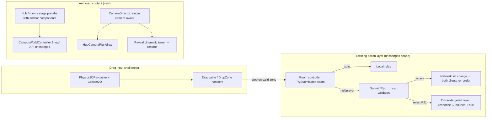

# feat: Wow Quality Pass — reference-bar art, drag-and-drop play, cinematic reveal

## Summary

Rebuild Career Quest Campus's player-facing experience to a committed reference bar: Kenney CC0 art in editor-authored prefab content (replacing the code-built world behind the existing `CampusWorldController.Show*` API), drag-and-drop direct manipulation in all three core rooms (submitting through the existing host-authoritative action path), a scripted-camera in-world cinematic reveal, TextMeshPro typography (Fredoka/Lexend), a three-tier audio system with Kenney SFX, and three tiers of polish (particles/cursor/packaging → transitions/lighting/title/ambience → game-feel/2P-presence/pause-menu). Sequenced flagship-first: campus walk → Design Build → reveal reaches the full bar and passes an owner checkpoint against committed references before the pattern replicates game-wide.

---

## Problem Frame

Three implementation passes shipped systems but never the experience: the world is code-built programmer art, mini-games are click-only button lists, the reveal is a UI overlay, and the game has no fonts, sound, or animation. Root causes: all visuals flow through code builders that can only emit what code can draw, and the quality bar was never a checkable artifact. Full audit and product requirements live in the origin document (see Sources & References).

Plan-specific framing: research confirmed the world swap is feasible behind the existing `CampusWorldController` public API (coupling is positional literals, not object references), but also surfaced latent correctness gaps that become real bugs under this pass — no reject-feedback channel for host-rejected drops, local-only blueprint state that hides the partner's placements, three uncoordinated camera writers with no restoration, and route-transition coroutines that don't cancel each other.

---

## Requirements

Origin R-IDs (R1–R25) carry forward unchanged from the origin document. Plan-added scope (agreed during planning dialogue) is traced as P-IDs:

**Tier 1 polish**
- P1. Unity ParticleSystem replaces hand-rolled confetti; particle celebration moments (ceremony, badge stamp, drag-drop accept, reveal burst).
- P2. Custom kid-friendly cursor (Kenney Cursor Pack) with a grab state during drags.
- P3. NPC emote bubbles (Kenney Emotes pack) for reactions and kid-safe 2P expression.
- P4. One ambient campus music loop plus per-room ambient flavor, crossfaded on room change.
- P5. Windows build packaging: app icon, splash, window title.

**Tier 2 polish**
- P6. Animated scene transition (iris/paper wipe) replacing the plain room veil.
- P7. Faked 2D stage lighting (glow sprites, gradient overlays) for the reveal — no URP migration.
- P8. Real title moment: Fredoka wordmark, live campus diorama with parallax/ambient motion behind the entry menu.
- P9. Named living-campus beats: drifting clouds, waving flag, butterflies/birds, NPC idle emotes.
- P10. First-run guided beat: guide greets player, speech-bubble points to nearest room, door pulses.
- P11. Footsteps with pitch variation.

**Tier 3 polish**
- P12. Ghost slot previews while dragging.
- P13. Host-seeded shuffled content per run (Health Hero cases, Logic Court evidence order).
- P14. NPC reaction beats in rooms (patient brightens, judge stamps, builder cheers).
- P15. Avatar celebrate animation on badge earn.
- P16. Player name tags + synced one-button emote (heart/star/wave) above avatars.
- P17. Partner drag indicator in shared rooms (highlight which piece the partner holds; not full drag mirroring).
- P18. Interactive hub toys (fountain splash, bell ring, flag flutter) — click-to-delight, no progress effect.
- P19. Campus evolution fanfare: camera nudge + sparkle when a city piece appears.
- P20. Pause/Escape menu: resume, SFX/music volume sliders (PlayerPrefs), fullscreen toggle, exit to title.

**Correctness prerequisites (research-discovered, required by origin AE2/AE3/R11/R13)**
- P21. Reject-feedback channel: host-rejected submissions produce a visible (and audible) response on the submitting client.
- P22. Shared slot/progress state renders from network state in multiplayer, not from local-only room state.
- P23. Single camera owner (CameraDirector) with guaranteed restoration on every exit path (skip, completion, disconnect, manual exit).
- P24. Route-transition cancellation: starting a new route cancels pending veil/boot coroutines from the previous one.

**Origin actors:** A1 (child player), A2 (evaluator/audience), A3 (owner).
**Origin flows:** F1 (flagship slice proof), F2 (mini-game direct manipulation), F3 (cinematic reveal).
**Origin acceptance examples:** AE1 (campus vs references), AE2 (2P drag accept/reject), AE3 (cinematic + locked branch), AE4 (zero fallback in optional rooms), AE5 (fonts everywhere), AE6 (audio with/without), AE7 (always launchable).

---

## Scope Boundaries

Carried from origin: no new careers or mini-game types; no persistence/accounts/WebGL/matchmaking; optional rooms get at-bar art but keep simpler (non-drag) interactions; audio scope is CC0 SFX + ambient loops, not composed music; 2P ship/test ceiling stays.

Plan-local exclusions (considered and rejected during planning):
- No Quaternius (3D-only), no SPUM (pixel art, restricted license), no Kenney City Kits (3D/pixel — perspective and style mismatch with the 2D cartoon diorama).
- No URP migration (stage lighting is faked with sprites — P7).
- No Cinemachine/Timeline packages (scripted coroutine camera — P23).
- No Input System package migration (legacy input + `StandaloneInputModule` works with `Physics2DRaycaster`).
- No voiceover, avatar customization layers, localization, achievements, gamepad support.
- No full partner drag mirroring (continuous drag-position sync) — P17's lightweight indicator only.

### Deferred to Follow-Up Work

- Capturing institutional learnings (meta-file hygiene, prefab-vs-builder coupling, TMP migration) into `docs/solutions/` after the pass lands — this repo has no solutions KB yet.
- Netcode scene split remains deferred per `TODOS.md` (tracked there at priority P3 — a TODOS.md priority label, not this plan's P3 requirement); nothing in this plan changes that.

---

## Context & Research

### Relevant Code and Patterns

- `Assets/_CareerQuest/Scripts/World/CampusWorldController.cs` — the swap seam: public `Show*`/`ClearWorld` API called from ~14 sites in `CareerQuestApp`; Layer A (decorative world) is replaceable wholesale behind it.
- `Assets/_CareerQuest/Scripts/Hub/PlayableHubController.cs` — interactive hub layer; entrance positions hardcoded; survives the swap with data rebinding.
- `Assets/_CareerQuest/Scripts/Art/AssetCatalog.cs` + `SpriteFallbackFactory.cs` — stable-ID art pipeline; `Resources.Load<Sprite>` wins over fallback, so dropping new PNGs at `Assets/Resources/CareerQuest/{Category}/{id}.png` replaces art with zero code change.
- `Assets/_CareerQuest/Scripts/Activities/DesignBuild/DesignBuildNetworkState.cs` — canonical host-authoritative pattern (`SubmitPlacementRpc` → validate → `NetworkList` → `Changed` event); drag-drop submits through the same methods.
- `Assets/_CareerQuest/Scripts/UI/UiBuilder.cs` — single UI factory; `DefaultFont` is the font choke point; every uGUI `Text` flows through `UiBuilder.Text`.
- `Assets/_CareerQuest/Scripts/UI/CareerRevealController.cs` — house coroutine-easing idiom (EaseOutBack, staged sequence) to reuse for camera tweens.
- `Assets/_CareerQuest/Scripts/Activities/Shared/CeremonyController.cs` — deterministic `Tick(deltaSeconds)` clock seam; extend the cinematic the same way.
- `Assets/_CareerQuest/Editor/CareerQuestSpriteKitGenerator.cs` + `ShipLadder.cs` + `CareerQuestBootstrapper.cs` — editor pipeline, gate, and scene bootstrap conventions.
- Conventions in force (from the Approach B plan): completion routes `ActivityResultEmitter` → `CeremonyController` → `SceneFlowRouter` (never direct `ShowGallery()`); `CareerQuestApp` is extended as a façade, never replaced; avatar-first test paths (no `BeginPlay()` shortcuts).

### Institutional Learnings

- No `docs/solutions/` KB exists. Learnings live in: origin doc's audit table (what U1–U8 promised but didn't ship), `docs/architecture.md` (client input → local preview → ServerRpc → host validates → broadcast), `docs/qa/README.md` (privacy rules, Practice-stamp tone, required same-computer 2P evidence), `docs/qa/2026-06-09-unity-bootstrap.md` (batchmode smoke wrapper; benign `Curl error 42` exit noise).
- Live working-tree signal: ~40 `.png.meta` files dirty with whitespace-only churn + LF/CRLF warnings — must be settled with `.gitattributes` before mass asset import multiplies it.
- Standing QA debt: Design Build shared placement has never been manually exercised by two clients — the drag conversion lands on the weakest-covered surface.

### External References

- Kenney packs (all CC0, no attribution required): Toon Characters 1 (characters with walk/idle frames), Background Elements Redux (parallax bands), New Platformer Pack / Platformer Pack Redux (ground/props/foliage), UI Pack, Game Icons, Emotes, Cursor Pack, UI Audio, Interface Sounds, Music Jingles, RPG Audio, Impact Sounds — kenney.nl/assets.
- Fredoka + Lexend: Google Fonts, SIL OFL 1.1 — ship OFL.txt alongside; use static TTF weights for TMP Font Asset Creator.
- Unity 6 facts (verified): TMP ships inside `com.unity.ugui 2.0.0` (already installed) but TMP Essential Resources are NOT imported — one-time editor step required before any `TextMeshProUGUI` is created; visual-only prefabs need no netcode registration; `Physics2DRaycaster` + `Collider2D` + `IDrag*` handlers work with `StandaloneInputModule`; only the `Default` sorting layer exists and assigning a nonexistent `sortingLayerName` fails silently — use `sortingOrder` bands; `AssetPostprocessor.OnPreprocessTexture` is the batch import-settings hook; stick to `SpriteImportMode.Single` (multi-sprite slicing needs the uninstalled `com.unity.2d.sprite` package).
- 2D sprite import for cartoon (non-pixel) art: Bilinear filter, high-quality or no compression for flat-color art, mipmaps off, one project-wide PPU (100), SpriteAtlas per usage group.

---

## Key Technical Decisions

- **World swap behind the existing API:** authored prefabs instantiate into the persistent scene via the unchanged `CampusWorldController.Show*` surface; visual-only prefabs carry no `NetworkObject` and need no netcode registration. Layer B (hub interactivity) rebinds to prefab-exported data instead of literals.
- **Prefab anchor contract:** room/hub prefabs expose named anchor components (entrances, walk bounds, slot zones, stage token slots, camera shots) — replacing three hardcoded coordinate sets (`PlayableHubController` entrances, `PlayerAvatarController` bounds, `PlayerAvatarNetwork.ClampCampus`) with one prefab-sourced truth. **The server clamp reads anchor data from the prefab asset (or a shared ScriptableObject), never a live scene instance** — route navigation is per-client, so the host can be inside a room (hub world cleared) while a client walks the campus and streams move RPCs; a hard fallback constant covers the asset-missing case. Live instances and the server clamp are both consumers of the same asset-sourced data.
- **Drag input is a thin shell over the existing action layer:** `Physics2DRaycaster` + `Collider2D` + `IBeginDrag/IDrag/IEndDrag`; drop validation via `Physics2D.OverlapPoint`; the drop calls the same `TryPlacePiece`/`SubmitStep` methods the buttons call today. Network protocol gains a **sender-targeted reject response** (P21: capture `RpcParams` sender client ID in the submit RPC, reply via a SendTo-specified RPC to that sender — NOT "owner"-targeted; the network states are server-owned shared objects, so owner-addressing would always hit the host) plus a completion guard. Reject payload echoes a client attempt-id so a stale reject cannot bounce a newer drag of the same piece; client-side reject handling defers one frame (the host's own rejects invoke synchronously inside the submit call stack). The optimistic local write in multiplayer (`SubmitPlacement` + local `TryPlacePiece` dual-write) is **deleted** — in 2P, slot rendering AND result accuracy derive from network state (P22); the existing double `Changed` fire on host accepts is removed in the same pass.
- **Network-state attempt lifecycle:** the three room NetworkLists currently never reset between attempts — masked today by local closure state, but fatal once P22 renders from network state (replay would show already-complete and reject every drop). Host resets a room's network state when a new attempt begins after completion; a player entering while a partner is mid-attempt joins the in-progress shared attempt (matches the one-result-per-attempt contract). Best-result replacement semantics are preserved by `GameSession` as today.
- **TextMeshPro over legacy Font:** SDF crispness, outlines, and auto-sizing are what "professional" requires; TMP is already bundled and the UI is centrally built, so migration is mechanical. World text (door labels, speech bubbles) uses world-space TMP, replacing `TextMesh`, so the font lands once.
- **Scripted CameraDirector, no Cinemachine:** orthographic position + `orthographicSize` tweens with the house coroutine-easing idiom; deterministic tick seam for tests; all camera writers (`EnsureSetup`, `HubCameraRig`, cinematic) route through it. CameraDirector **adopts-or-creates the camera and tags it MainCamera** (the lazily created `CampusWorldCamera` is currently untagged, leaving `Camera.main` null in empty-scene tests), **owns the `Physics2DRaycaster` attach point**, and becomes the only source of the Camera reference — `Camera.main` reads (e.g., `PlayerAvatarController` screen-to-world) are banned alongside writes. Parallax is driven from the director's own tick so it always runs after the camera write.
- **Cinematic sync model:** reveal start host-syncs **only for clients already on the reveal route** (navigation is per-client and the plan adds no forced routing); each client begins at a latch — max(sync RPC received, local stage mounted) — never on RPC receipt alone. Skip acts per-client (cameras and world beats are local visuals; full skip-sync would couple both players' cameras). Skip fast-forwards world beats to end-state, never leaves half-traveled tokens.
- **2P test infrastructure:** the existing `NetcodePlayModeHarness` is host-only and cannot execute true two-client scenarios. U6 adopts NGO's bundled `Unity.Netcode.TestHelpers.Runtime` (`NetcodeIntegrationTest`, multiple in-process NetworkManagers) for the 2P accept/reject/shared-state scenarios; if the helpers prove unstable in this project, those scenarios explicitly downgrade to manual-evidence rows in U9/U14 rather than silently passing host-only.
- **Code-driven frame animation, no Animator assets:** `Sprite[]` frame cycling at 8–12 fps with `flipX` facing; remote avatars derive walk/idle from synced position deltas with a deadzone (the network lerp produces residual motion that would flicker walk state).
- **Sorting via `sortingOrder` bands on the Default layer** (background 0–99, midground 100–199, world 200–299, characters 300–399, foreground 400+): fully code/prefab-driven, avoids the silent-failure trap of named sorting layers that don't exist in `TagManager.asset`.
- **Audio: three-tier AudioManager on the app object** (UI one-shot source; 4–8 pooled gameplay sources with per-cue pitch ±5–10%; 1–2 looping ambient/music sources with coroutine crossfade). Preserves `AudioCueCatalog`'s silent no-op on missing clips; adds per-cue-ID throttle; SFX play locally in response to synced events — playback itself is never networked.
- **Buildings from upgraded owned art:** Kenney has no 2D cartoon town buildings; campus structures get regenerated/hand-tuned owned art styled to the Kenney palette, approved at the U1 reference checkpoint. All other categories (characters, backgrounds, props, UI, cursor, emotes, audio) come from Kenney.
- **Test seams over pointer simulation:** every drag room exposes a programmatic `TrySubmitDrop(pieceId, slotId)`-style entry plus state queries (`IsPieceAccepted`, drag-lock, reject event); PlayMode tests drive logic through seams, not synthetic pointer events. The 23 `onClick.Invoke()` driver sites across 5 test files migrate per-unit (the `FindButton` helper itself exists only in CeremonyFlow and PlayModeUx; the other files invoke buttons directly).

---

## Open Questions

### Resolved During Planning

- Font wiring: TextMeshPro migration (see Key Technical Decisions) — resolves origin's font question.
- Camera approach: scripted CameraDirector coroutines; Cinemachine rejected (origin's camera question).
- Pack selection: Kenney-only; Quaternius is 3D-exclusive; SPUM rejected (style + license); buildings from upgraded owned art (origin's pack/character question).
- Coupling depth: verified shallow — swap behind `CampusWorldController.Show*`; positional literals move to prefab anchors (origin's coupling question).
- Test rework inventory: `Tests/PlayMode/HubWarmupPlayModeTests.cs` (veil/decor frame timing), `HubNavigationFlowTests.cs` (7 entrances), `PlayModeUxPlayModeTests.cs`, `CeremonyFlowPlayModeTests.cs` (14 of 23 driver sites), `DesignBuildFlowTests.cs`, `OptionalMiniGameFlowTests.cs` (origin's test question).

### Deferred to Implementation

- Exact Kenney sprite selections per catalog ID and final PPU/scale tuning against existing world units — needs in-editor visual iteration; the U1 checkpoint approves direction, not every sprite.
- Hub prefab composition details (exact prop placement, parallax band contents) — authored visually in-editor against the references.
- Whether the wipe transition (P6) renders as a screen-space mask or world-space overlay — pick whichever composites better with the veil rework in U4.
- TMP atlas sampling sizes and material preset values — tuned in Font Asset Creator against on-screen results.
- Final audio clip choices per cue ID from the Kenney packs — curated by ear during U8.

---

## High-Level Technical Design

> *This illustrates the intended approach and is directional guidance for review, not implementation specification. The implementing agent should treat it as context, not code to reproduce.*

Camera ownership: `EnsureSetup`, `HubCameraRig`, and the cinematic all become clients of CameraDirector; every exit path (skip, completion, disconnect, manual exit) runs the same restore.

---

## Implementation Units

Phased delivery: Phase A (U1–U3 foundation) → Phase B (U4–U9 flagship slice + checkpoint) → Phase C (U10–U14 replication and completion).

### U1. Reference bar, asset pipeline, and import hygiene

**Goal:** The quality bar becomes a committed artifact; all external assets (Kenney packs, fonts, audio) enter the repo cleanly; the art-direction reversal is recorded.

**Requirements:** R1, R2 (gate definition), R4, R7; P5 groundwork (icon source), P2/P3 (packs land here, wired later).

**Dependencies:** None.

**Files:**
- Create: `docs/references/` (reference screenshots: Toca Boca World, Skillsville, Khan Academy Kids; Kenney pack previews; building-art direction sample), `.gitattributes` (`*.meta text eol=lf`), `Assets/_CareerQuest/Art/Kenney/` (curated pack imports), `Assets/Fonts/` (Fredoka + Lexend static TTFs + OFL.txt), `Assets/_CareerQuest/Editor/CareerQuestTexturePostprocessor.cs`
- Modify: `DESIGN.md` (decision log: imported-assets-first, generator demoted to fallback; sources locked), `docs/art-direction.md` (same amendment)
- Test: `Assets/_CareerQuest/Tests/EditMode/` — existing `AssetCatalogTests.cs` / `AssetValidationTests.cs` keep passing

**Approach:**
- Settle the `.png.meta` whitespace churn (commit or revert) and land `.gitattributes` BEFORE the mass import, so asset diffs stay reviewable.
- `AssetPostprocessor.OnPreprocessTexture` scoped to CareerQuest art paths: Sprite/Single, 100 PPU, bilinear, mipmaps off, high-quality/no compression.
- Produce one upgraded campus-building art sample styled to the Kenney palette and place it beside references in `docs/references/` — this is the artifact for the owner checkpoint on building direction.
- Kenney packs imported into `Assets/_CareerQuest/Art/Kenney/` (review location); only curated, catalog-ID-named copies go under `Assets/Resources/CareerQuest/` in later units (keeps build size controlled and the catalog convention intact).

**Test scenarios:**
- Happy path: re-importing any CareerQuest PNG yields the postprocessor settings (PPU 100, bilinear, no mipmaps) without manual inspector edits.
- Edge case: a PNG outside CareerQuest paths is untouched by the postprocessor.
- Test expectation for docs/`.gitattributes` changes: none — non-behavioral.

**Verification:**
- `docs/references/` exists with reference captures + building sample; owner has affirmed the building-art direction; `git status` is clean of whitespace-only meta churn after a full reimport; DESIGN.md decision log records the reversal.

---

### U2. Typography: TextMeshPro with Fredoka/Lexend

**Goal:** Every text surface uses Fredoka (display) / Lexend (body) at DESIGN.md scale through TMP; no surface remains on LegacyRuntime/Arial.

**Requirements:** R14; AE5.

**Dependencies:** U1 (font files).

**Files:**
- Create: TMP Essential Resources (one-time editor import), `Assets/Resources/CareerQuest/Fonts/` (baked SDF font assets), `Assets/_CareerQuest/Scripts/UI/TypeStyles.cs` (display/body role + scale constants per DESIGN.md)
- Modify: `Assets/_CareerQuest/Scripts/UI/UiBuilder.cs` (Text → TMP creation; role parameter), `Assets/_CareerQuest/Scripts/UI/CareerQuestApp.cs`, `Assets/_CareerQuest/Scripts/Activities/Shared/ActivityRoomChrome.cs` (note: `QuestHudRefs` is a public struct exposing `Text` properties — an API-type change for all consumers), `Assets/_CareerQuest/Scripts/UI/QuestStageUi.cs`, `Assets/_CareerQuest/Scripts/UI/InstructionStrip.cs`, `Assets/_CareerQuest/Scripts/UI/DemoDebugOverlay.cs` (serialized `Text` field, not just `GetComponent` sites) and remaining `GetComponent<Text>()` call sites
- Test: `Assets/_CareerQuest/Tests/PlayMode/PlayModeUxPlayModeTests.cs` (its `Resources.FindObjectsOfTypeAll<Text>()` scan is the AE5 surface itself), `EntryFlowTests.cs`, `AvatarSelectionFlowTests.cs`, `DesignBuildFlowTests.cs`, `OptionalMiniGameFlowTests.cs` — all read `Text` components and migrate to TMP reads

**Approach:**
- Import TMP Essential Resources first (hard prerequisite — runtime `TextMeshProUGUI` creation fails without `TMP_Settings`).
- Bake SDF assets in Font Asset Creator (static weights), load via Resources; never generate atlases at runtime.
- `UiBuilder.Text` gains a display/body role; all call sites map titles → Fredoka, body/buttons → Lexend per the DESIGN.md scale table.
- World text policy: `TextMesh` usages are NOT migrated here — door labels and `CampusWorldBuilder.AddLabel` die with the old world in U4; the guide's `GuidePrompt` TextMesh is replaced by the speech-bubble component in U5 (explicit owner). The U2 "zero legacy font" scan stays scoped to active uGUI hierarchies and does not assert over `TextMesh` (world text is legitimately legacy until U4/U5 land).

**Test scenarios:**
- Covers AE5. Happy path: after migration, scanning active UI hierarchies in entry/avatar/campus/room/gallery/reveal states finds zero legacy `Text` components and zero `LegacyRuntime`/Arial font references.
- Integration: ceremony overlay text fields (read via `GetComponent` in `CareerQuestApp`) render and update through TMP during a completion flow.
- Edge case: long kid-facing strings (instruction strip) wrap/auto-size without overflow at 1280x720 and at a 16:10 resolution.

**Verification:**
- Full PlayMode suite green after `Text`→TMP test migration; screenshots of every screen show the new type roles.

---

### U3. CameraDirector: single camera owner with restoration guarantees

**Goal:** One component owns the camera; follow, route framing, and cinematics are requests to it; every exit path restores a known shot.

**Requirements:** P23; prerequisite for R12/R13 (AE3) and parallax (R8).

**Dependencies:** None (parallel with U1/U2).

**Files:**
- Create: `Assets/_CareerQuest/Scripts/World/CameraDirector.cs`, `Assets/_CareerQuest/Tests/PlayMode/CameraDirectorPlayModeTests.cs`
- Modify: `Assets/_CareerQuest/Scripts/World/CampusWorldController.cs` (EnsureSetup routes camera creation/reset through the director), `Assets/_CareerQuest/Scripts/Hub/HubCameraRig.cs` (becomes a follow-mode client), `Assets/_CareerQuest/Scripts/Hub/PlayableHubController.cs` (its `Camera.main` read at the camera-rig configure call migrates to the director-provided reference)

**Approach:**
- Modes: fixed shot (rooms), follow (hub), tween-to-shot (cinematic). Deterministic `Tick(deltaSeconds)` seam mirroring `CeremonyController` so tests fast-forward without real-time waits; inspectable state (current shot, is-restored).
- Adopt-or-create-and-tag semantics: the director adopts an existing MainCamera or creates one and tags it `MainCamera` (the current lazily created `CampusWorldCamera` is untagged, leaving `Camera.main` null in empty-scene tests). The director owns the `Physics2DRaycaster` attach point (added in U6) and is the only source of the Camera reference.
- Route changes always reset to that route's shot — this is the restoration guarantee all U7 exit paths rely on.

**Test scenarios:**
- Happy path: follow mode tracks a moving target within hub clamp; switching to a room route snaps to the room's fixed shot.
- Edge case: starting a tween while another is active cancels the first cleanly (no position jump past the target).
- Error path: a forced reset (disconnect-style) mid-tween restores the route shot within one tick.
- Integration: `HubCameraRig` behavior is preserved through the director (existing hub framing unchanged).

**Verification:**
- All camera writes AND reads route through CameraDirector (grep-verifiable: no other `Camera.main` access remains — `PlayerAvatarController`'s screen-to-world read migrates too).

---

### U4. Authored campus hub world (flagship environment)

**Goal:** The campus reads as a toy-diorama environment at the reference bar: authored prefab content, 4+ parallax bands, ambient motion, door signage, animated transitions — replacing the code-built hub behind the unchanged `Show*` API.

**Requirements:** R5, R7, R8; P6, P8, P9, P24; AE1.

**Dependencies:** U1 (art), U3 (camera). U2 recommended first (world signage uses world-space TMP).

**Files:**
- Create: `Assets/_CareerQuest/Prefabs/World/CampusHub.prefab` (+ parallax band children), `Assets/_CareerQuest/Scripts/World/WorldAnchors.cs` (entrances, walk bounds, spawn points exported as data), `Assets/_CareerQuest/Scripts/World/ParallaxLayer.cs`, `Assets/_CareerQuest/Scripts/World/AmbientMotion.cs` (clouds drift, flag wave, butterflies), `Assets/_CareerQuest/Scripts/World/SceneWipe.cs` (iris/paper transition)
- Modify: `Assets/_CareerQuest/Scripts/World/CampusWorldController.cs` (hub route instantiates the prefab; BeginHub cancels pending room veil and vice versa — P24; `ShowEntry`/`ShowConnection`/`ShowProof` also draw hub-style worlds and are in scope — P8 makes `ShowEntry` load-bearing), `Assets/_CareerQuest/Scripts/World/RoomVeilController.cs` / `HubBootController.cs` (cancellation + wipe integration; both are plain C# classes coroutine-hosted on the controller, not MonoBehaviours), `Assets/_CareerQuest/Scripts/World/BuildingEntranceController.cs` (retired/replaced — the seven hub buildings are built here today), `Assets/_CareerQuest/Scripts/World/CampusWorldBuilder.cs` (hub surfaces and `AddFullScreenVeil` replaced; the builder itself stays alive until U6/U7/U10 because room scenes still use it), `Assets/_CareerQuest/Scripts/Hub/PlayableHubController.cs` (entrances/bounds from `WorldAnchors`), `Assets/_CareerQuest/Scripts/Hub/PlayerAvatarController.cs` + `Assets/_CareerQuest/Scripts/Networking/PlayerAvatarNetwork.cs` (both clamps consume the same asset-sourced anchor data — server side reads the prefab asset, never a live instance), `Assets/_CareerQuest/Scripts/UI/EntryScreenController.cs` (title moment over live campus — P8)
- Test: `Assets/_CareerQuest/Tests/PlayMode/HubWarmupPlayModeTests.cs`, `HubNavigationFlowTests.cs` (anchors-only exposure: drives `TryEnter`, asserts entrance count), `EntryFlowTests.cs` (EntryScreenController rewrite)

**Approach:**
- Hub prefab is visual-only (no NetworkObject) — free client-side instantiation into the persistent scene.
- Parallax: per-band `LateUpdate` factor script sampling CameraDirector deltas; re-anchors on route change; `sortingOrder` bands per Key Technical Decisions.
- The three coordinate truths (entrances, local clamp, server clamp) all read from `WorldAnchors` — eliminating today's hub-vs-network bounds divergence.
- Buildings use the U1-approved upgraded owned art; backgrounds/props/foliage from Kenney packs, all routed through AssetCatalog IDs (new PNGs at existing `Resources/CareerQuest/` paths replace art with no code change).

**Execution note:** Characterize current route-transition behavior (veil flags, decor timing) in tests before replacing the builders — the cancellation asymmetry fix changes frame-level behavior tests currently encode.

**Test scenarios:**
- Covers AE1 (gate is the owner side-by-side at U9). Happy path: campus route shows the prefab hub; all seven entrances reachable; veil/wipe shows and clears.
- Edge case (P24): route A→B→A within the transition window — final world matches final route; veil/boot state flags consistent; no orphaned content from the cancelled build.
- Edge case: every `WorldAnchors` entrance position lies inside both the local and server walk-clamp rects (single-source verification test).
- Integration: parallax bands hold alignment during hub follow-drift and re-anchor without jump after a room round-trip.
- Integration: entry screen renders over the live campus with ambient motion running (P8) and routes Play → avatar select unchanged.

**Verification:**
- Hub screenshots beside `docs/references/` captures read as the same genre of environment; HubWarmup/HubNavigation suites green against the prefab world.

---

### U5. Character presence: animation, locomotion sync, name tags, speech bubbles

**Goal:** Avatars and NPCs read as alive: frame-animated walk/idle with facing, correct remote-player animation, name tags, guide speech bubbles, and the first-run guided beat.

**Requirements:** R6, R9, R19; P10, P15 (celebrate animation, wired into ceremony in U7), P16 (name tags; synced emote lands in U12), P3 (emote sprites).

**Dependencies:** U1 (Toon Characters frames), U2 (world-space TMP), U4 (hub anchors).

**Files:**
- Create: `Assets/_CareerQuest/Scripts/Avatar/SpriteFrameAnimator.cs`, `Assets/_CareerQuest/Scripts/UI/SpeechBubble.cs` (world-space TMP + DESIGN.md bubble styling), `Assets/_CareerQuest/Scripts/Hub/FirstRunGuideBeat.cs`
- Modify: `Assets/_CareerQuest/Scripts/Avatar/AvatarRuntimeView.cs` (frame sets per avatar id), `Assets/_CareerQuest/Scripts/Hub/PlayerAvatarController.cs` (drive walk/idle/facing locally), `Assets/_CareerQuest/Scripts/Networking/PlayerAvatarNetwork.cs` (remote locomotion from position deltas with deadzone; name tag), `Assets/_CareerQuest/Scripts/Hub/CampusGuideController.cs` (speech bubbles replace the `GuidePrompt` TextMesh — the last TextMesh dies here; door-pulse pointer), `Assets/_CareerQuest/Scripts/Art/AssetCatalog.cs` (avatar/NPC definitions remap to Kenney Toon Character art; `.walk` frame convention extended)
- Test: `Assets/_CareerQuest/Tests/PlayMode/AvatarPresencePlayModeTests.cs` (new), existing avatar selection tests updated for new art

**Approach:**
- Code-driven `Sprite[]` cycling (8–12 fps), `flipX` facing — no Animator assets, no NetworkAnimator. Remote players derive moving/idle from `_networkPosition` deltas with a deadzone to absorb network-lerp residual motion.
- Avatar selection screen gets the new characters on the passport-card layout (R6: generated character art retired from the player-facing path).
- First-run beat (P10): on first hub entry per session, guide greets via speech bubble naming the chosen avatar, points to nearest unplayed room, door sign pulses per DESIGN.md motion rules.

**Test scenarios:**
- Happy path: local avatar shows walk frames + correct facing while moving, idle bob at rest.
- Edge case: remote avatar at rest does NOT flicker between walk/idle (deadzone holds under lerp residue).
- Happy path: name tags render over both avatars in a 2P harness session.
- Integration (P10): first hub entry triggers the guide beat once; re-entry the same session does not repeat it; the pointed door pulses.
- Edge case: speech bubble truncates/wraps gracefully on the longest guide line (≤ 2 lines per DESIGN.md).

**Verification:**
- 2P harness clip: both avatars animate correctly from each client's view; avatar select → campus shows the same character identity throughout.

---

### U6. Drag-and-drop framework + Design Build conversion (flagship room)

**Goal:** Design Build plays through drag-and-drop with reference-bar feel; the framework (drag shell, drop validation, reject channel, locks, test seams) is built once for all rooms.

**Requirements:** R10, R11; P12, P14 (builder NPC reactions), P17 groundwork (held-piece state), P21, P22; AE2; F2.

**Dependencies:** U1 (art), U4 (prefab conventions, room transition), U3 (room shots).

**Files:**
- Create: `Assets/_CareerQuest/Scripts/Interaction/DraggablePiece.cs`, `Assets/_CareerQuest/Scripts/Interaction/DropZone.cs`, `Assets/_CareerQuest/Scripts/Interaction/DragFeel.cs` (lift/scale/shadow/snap-back/ghost-preview), `Assets/_CareerQuest/Prefabs/Rooms/DesignBuildStudio.prefab` (blueprint table, piece tray, slot anchors, builder NPC), `Assets/_CareerQuest/Tests/PlayMode/DragInteractionPlayModeTests.cs`, two-client integration tests on NGO's `Unity.Netcode.TestHelpers.Runtime` (`NetcodeIntegrationTest` — the existing harness is host-only and cannot execute the 2P scenarios below; if the helpers prove unstable here, those scenarios downgrade to manual-evidence rows, never silent host-only passes)
- Modify: `Assets/_CareerQuest/Scripts/Activities/DesignBuild/DesignBuildController.cs` (room renders from prefab + drag; closure state moves to room-state object; `TrySubmitDrop` seam + state queries; slot fill AND result accuracy render/derive from network state in 2P — P22; the optimistic local dual-write is deleted), `Assets/_CareerQuest/Scripts/Activities/DesignBuild/DesignBuildNetworkState.cs` (sender-targeted reject response with attempt-id echo — P21; completion guard on submissions; host-side `ResetForAttempt` when a new attempt begins after completion; remove the duplicate `Changed` fire on host accepts), `Assets/_CareerQuest/Scripts/Hub/PlayerAvatarController.cs` (pointer-over-UI/world guard so hub clicks don't double-handle once Physics2D raycasts join — also covers U12 toys), `Assets/_CareerQuest/Scripts/World/CampusWorldController.cs` + `CampusRoomScenes.cs` (Design Build route uses the prefab), `Assets/_CareerQuest/Scripts/UI/UiBuilder.cs` (non-raycast-blocking defaults in the panel/shape/text factories, Buttons excepted — the four blocking `FullPanel` room backgrounds are `DesignBuildPanel`, `HealthHeroPanel`, `LogicCourtPanel`, and the optional-room `{prefix}Panel`; `MountQuestHud`/tool trays are edge bands and may stay blocking)
- Test: `Assets/_CareerQuest/Tests/PlayMode/DesignBuildFlowTests.cs`, `PlayModeUxPlayModeTests.cs` (migrate from FindButton drivers to the seam)

**Approach:**
- `Physics2DRaycaster` added to the camera once (framework-level); pieces carry `Collider2D` + drag handlers; the dragged piece's collider disables during drag; drop resolves via `Physics2D.OverlapPoint` against zone IDs.
- Full-screen HUD panels and decorative images set `raycastTarget=false` — the known "drag doesn't work at all" failure.
- Drop calls the existing `TryPlacePiece` path; in multiplayer the RPC validates; reject response (P21) triggers snap-back + reject cue + gentle feedback copy on the submitting client only.
- Interaction lock: a single drag-lock flag raised by completion/ceremony; drag handlers and host submission guard both check it.
- Feel per research: pickup lift (~1.08 scale, +100 sortingOrder, shadow), ghost slot preview (P12), snap-back tween 0.15–0.25s ease-out, accept punch + particle poof (P1), builder NPC cheer on accept (P14).
- Teardown safety: world-clear cancels any active drag; `OnEndDrag` guards against destroyed hierarchy (disconnect mid-drag).

**Execution note:** Test-first on the framework seams — write the 2P accept/reject scenarios against `TrySubmitDrop` before building the pointer shell.

**Test scenarios:**
- Covers AE2 / F2. Integration (2P harness): A drops a piece on a valid slot — host validates, both clients render it placed; B then submits the same piece — B receives the reject response, B's piece snaps back, B's feedback text updates, A is unaffected.
- Covers AE2. Integration (P22): A places a piece; B's slot renders occupied and B cannot pick up the accepted piece.
- Happy path: drop on a wrong-piece slot bounces with gentle feedback (no harsh copy, Practice-tone rules).
- Edge case: drop released over no zone returns the piece to the tray.
- Edge case (lock): after completion fires, pieces are non-draggable; a submission arriving host-side after completion is ignored (completion guard).
- Error path: disconnect mid-drag — no exceptions, no orphaned drag sprite, world clears cleanly.
- Edge case: pointer-down over a piece with the HUD mounted starts a drag (raycast-blocking regression guard).
- Edge case (attempt lifecycle): after a completed attempt's ceremony, re-entering Design Build starts a fresh attempt — slots render empty, drops are accepted (NetworkList reset); a player entering while the partner is mid-attempt sees and joins the in-progress state instead of wiping it.
- Edge case (stale reject): a reject response carrying an old attempt-id arrives after the player has started a newer drag of the same piece — the newer drag is unaffected.
- Integration: completing via drags routes `ActivityResultEmitter` → ceremony → router exactly as the button flow did (single result per attempt).

**Verification:**
- Solo and 2P manual pass: place all pieces by drag in both modes; migrated test suites green; a clip of the 2P accept/reject exchange exists for QA evidence.

---

### U7. Cinematic reveal (in-world ceremony)

**Goal:** The reveal is a world event: camera moves to an authored stage, badge tokens travel to slots, light sweep and unlock burst play in-world, locked state shows progress — inside the locked ceremony pacing contract.

**Requirements:** R12, R13, R22 (gate semantics unchanged); P1, P7, P15 (celebrate animation fires here), P23 (consumed); AE3; F3.

**Dependencies:** U3 (CameraDirector), U4 (world conventions), U5 (avatar celebrate), U1 (art).

**Files:**
- Create: `Assets/_CareerQuest/Prefabs/World/RevealStage.prefab` (stage, token slot anchors, glow/gradient lighting sprites — P7, camera shot anchors), `Assets/_CareerQuest/Scripts/UI/RevealCinematicDirector.cs` (beat sequencer on a deterministic tick)
- Modify: `Assets/_CareerQuest/Scripts/UI/CareerRevealController.cs` (rewrite: world-first sequence, UI reduced to result copy + actions; locked branch), `Assets/_CareerQuest/Scripts/World/CampusRoomScenes.cs` (reveal route mounts the stage prefab), `Assets/_CareerQuest/Scripts/UI/CareerQuestApp.cs` (ceremony overlay uses ParticleSystem confetti — P1; reveal start host-sync RPC via `CampusSessionState`), `Assets/_CareerQuest/Scripts/Core/CampusSessionState.cs` (reveal-start sync moment)
- Test: `Assets/_CareerQuest/Tests/PlayMode/CeremonyFlowPlayModeTests.cs` (migrate FindButton drivers; add cinematic scenarios), `Assets/_CareerQuest/Tests/PlayMode/RevealCinematicPlayModeTests.cs` (new)

**Approach:**
- Beat sequence (within ~12s cap, Skip after 3s): camera tween to stage → tokens travel ×N → light sweep (700–1200ms per DESIGN.md) → unlock burst (particles) + avatar celebrate → result copy. Locked branch (<3 badges): short settle shot, locked slots with 2/3 state, no Skip button, no full cinematic.
- Start host-syncs only for clients already on the reveal route (no forced navigation exists or is added); each client begins at the latch — max(sync RPC received, local stage mounted) — never on RPC receipt alone. Skip is per-client and fast-forwards world beats to end-state (tokens snapped to slots, tweens killed, camera at final shot) — never half-traveled visuals.
- Every exit path (skip, natural completion, Campus/Gallery action, `CancelCeremony` on disconnect) routes through one teardown that stops beats and restores the camera via CameraDirector. Exit actions mount only after the sequence resolves or skip fires (today they mount immediately — that gap closes).
- Stale-count guard: reveal readiness checks the synced unique-game count at trigger time; a client with a stale snapshot gets the locked branch, which self-corrects on the next state change.

**Test scenarios:**
- Covers AE3 / F3. Happy path (deterministic tick): 3 badges → full beat sequence completes ≤ 12s; tokens end in slots; camera restored on exit to campus.
- Covers AE3. Edge case: 2 badges → locked stage, 2/3 slots, no Skip control, no camera cinematic beyond the settle shot.
- Edge case: skip at every beat boundary (mid-camera-tween, mid-token-travel, mid-sweep) — end-state scene correct, camera restored, no stranded tweens.
- Error path: forced disconnect mid-cinematic — `CancelCeremony` path stops beats, restores camera, world returns to a safe route.
- Integration (2P): both clients on the reveal route — host triggers reveal, both start at their latch moment; A skips at 3.5s, B watches to completion uncorrupted. Variant: B is still in a room — B's session is unaffected (no forced routing), and B entering reveal later gets the normal local sequence.
- Edge case: reveal copy remains strength-based; gate count unchanged (regression guard on R22).

**Verification:**
- Clip of the full cinematic and the locked state for QA evidence; ceremony suites green; manual 2P reveal pass recorded.

---

### U8. Audio system and full cue set

**Goal:** The game sounds designed: three-tier AudioManager, every existing cue ID backed by a real clip, footsteps, ambient campus + per-room flavor, music loop — fully understandable with audio off.

**Requirements:** R20; P4, P11; AE6.

**Dependencies:** U1 (Kenney audio packs). Wires into U4–U7 surfaces as they exist.

**Files:**
- Create: `Assets/Resources/Audio/` (curated clips named per cue convention: `ceremony_{design_build|health_hero|logic_court}_{success|practice}`, plus button/pickup/accept/reject/badge/reveal/footstep/ambient/music IDs), `Assets/_CareerQuest/Scripts/Audio/AudioDirector.cs` (three tiers, pooling, pitch variation, per-cue throttle, crossfade)
- Modify: `Assets/_CareerQuest/Scripts/Activities/Shared/AudioCueCatalog.cs` (routes through AudioDirector; keeps silent no-op on missing clips), `Assets/_CareerQuest/Scripts/UI/UiBuilder.cs` (button press cue hook), drag/ceremony/reveal call sites for their cues, `Assets/_CareerQuest/Scripts/Hub/PlayerAvatarController.cs` (footstep cadence)
- Test: `Assets/_CareerQuest/Tests/EditMode/AudioCueCoverageTests.cs` (new: every cue ID referenced in code resolves to a clip in Resources/Audio), `Assets/_CareerQuest/Tests/PlayMode/` additions for throttle/no-op behavior

**Approach:**
- AudioDirector lives on the app object (survives `ClearWorld`); UI tier = single 2D `PlayOneShot` source; gameplay tier = 4–8 pooled sources with pitch ±5–10%; ambient/music tier = looping sources with ~1s coroutine crossfade on room change (P4 per-room flavor).
- Import settings: short SFX decompress-on-load (wav/ogg), loops streaming/compressed; ogg or wav for loops (never mp3 — leading-silence gap).
- Per-cue-ID minimum interval throttles drag-spam; skip ducks/stops fanfare; reject cue fires from the P21 reject response.

**Test scenarios:**
- Covers AE6. Happy path: drop-accept, badge stamp, and reveal each play a distinct cue (audible in manual pass; programmatically, TryPlay returns success).
- Covers AE6. Edge case: with all clips absent, every flow completes identically (silent no-op preserved).
- Edge case: 10 rapid pickup/drop actions within the throttle window play a bounded number of cue instances.
- Integration: room change crossfades ambient flavor; returning to hub restores campus ambience + music loop.

**Verification:**
- Cue-coverage EditMode test green (every referenced cue ID has a clip); manual soundcheck across the flagship path.

---

### U9. Flagship checkpoint: evidence and owner review

**Goal:** Prove the bar before replication: side-by-side evidence of the flagship slice against `docs/references/`, plus the required manual 2P pass on the drag surface.

**Requirements:** R2 (milestone gate), R24 (launchable); F1; AE7 spot-check.

**Dependencies:** U2–U8 complete.

**Files:**
- Create: `docs/qa/2026-XX-XX-flagship-slice-review.md` (1280x720 screenshots/clips: title, campus walk, Design Build drag session, ceremony, reveal cinematic + locked state; side-by-side composites with references; 2P manual evidence notes)
- Modify: none (fix loop excepted)

**Approach:**
- Use the existing `-cq-visual-state`/`-cq-screenshot` headless hooks where they fit; manual capture for motion clips. Run ShipLadder; record results. Owner reviews against references and affirms or redirects — redirects are fixed here before Phase C multiplies the pattern (F1).

**Test scenarios:**
- Test expectation: none — evidence/review unit; the gate is the owner's side-by-side affirmation plus green ShipLadder.

**Verification:**
- Owner has affirmed "this is the game I described" (origin success criterion) or the fix loop has addressed redirects; ShipLadder log green; 2P drag evidence recorded.

---

### U10. Health Hero + Logic Court conversion (replication)

**Goal:** Both remaining core rooms reach the flagship pattern: authored room prefabs, drag interactions (care tools → patient, evidence → sorting zones), NPC reactions, shuffled content.

**Requirements:** R16, R17 (core-room art); P13, P14; F2.

**Dependencies:** U6 (framework), U9 (approved pattern).

**Files:**
- Create: `Assets/_CareerQuest/Prefabs/Rooms/HealthHeroClinic.prefab`, `Assets/_CareerQuest/Prefabs/Rooms/LogicCourt.prefab`
- Modify: `Assets/_CareerQuest/Scripts/Activities/HealthHero/HealthHeroController.cs`, `Assets/_CareerQuest/Scripts/Activities/LogicCourt/LogicCourtController.cs` (drag conversion via the U6 framework; `TrySubmitDrop` seams; network slot state), `Assets/_CareerQuest/Scripts/Networking/HealthHeroNetworkState.cs`, `LogicCourtNetworkState.cs` (reject responses + completion guards, mirroring U6; host-seeded shuffle — P13), `Assets/_CareerQuest/Scripts/World/CampusRoomScenes.cs` (routes use prefabs)
- Test: `Assets/_CareerQuest/Tests/PlayMode/PlayModeUxPlayModeTests.cs`, `OptionalMiniGameFlowTests.cs`, plus new per-room drag scenarios mirroring U6's

**Approach:**
- Pure replication of U6's framework — no new interaction concepts. Health Hero: drag tools to the patient zone; wrong tool bounces with gentle teaching copy. Logic Court: drag evidence cards to sorting zones; judge stamps on completion (P14).
- Shuffle (P13): host seeds case/evidence order at room start and syncs the seed so both clients see identical order; solo shuffles locally.

**Test scenarios:**
- Per room, the U6 scenario set replays: 2P accept/reject, shared state rendering, lock-after-complete, no-zone snap-back, disconnect safety.
- Happy path (P13): two consecutive runs produce different orderings; in 2P both clients render the same host-seeded order.
- Integration: each room emits exactly one result through the ceremony path; best-result replacement semantics unchanged.

**Verification:**
- All three core rooms play by drag in solo and 2P; full PlayMode suite green; room screenshots at the bar.

---

### U11. Optional rooms, badges, gallery, and campus evolution

**Goal:** Nothing player-facing shows fallback art: optional-room badges exist as real art, optional rooms get the at-bar art pass (keeping simple interactions), gallery reads as a passport book, city pieces celebrate their arrival.

**Requirements:** R3, R15, R17 (optional rooms), R18; P19; AE4.

**Dependencies:** U1 (art), U4 (world conventions), U9 (approved pattern).

**Files:**
- Modify: `Assets/_CareerQuest/Scripts/Art/AssetCatalog.cs` (add `badge.ai_lab`, `badge.music_studio`, `badge.robotics_garage`, `badge.community_kitchen` definitions; flip optional-room definitions to required-for-acceptance), `Assets/Resources/CareerQuest/Badge/` + `Room/` + `Campus/` (real art for optional surfaces), `Assets/_CareerQuest/Scripts/Activities/Optional/OptionalRoomController.cs` (at-bar room dressing via prefab/catalog), `Assets/_CareerQuest/Scripts/UI/AchievementGalleryController.cs` (passport/sticker-book polish), `Assets/_CareerQuest/Scripts/World/CampusWorldBuilder.cs` or successor (city-piece arrival fanfare — P19: camera nudge + sparkle on badge-earn)
- Test: `Assets/_CareerQuest/Tests/EditMode/SpriteFallbackGateEditModeTests.cs` (extend gate to the full player-facing catalog — R3), `Assets/_CareerQuest/Tests/EditMode/AssetCatalogTests.cs` (new badge IDs)

**Approach:**
- Adding the four badge definitions makes the extended gate enforce their final art automatically — the test pipeline does the policing.
- City-piece evolution (R18) verified working, then dressed with P19's fanfare (CameraDirector nudge + particle sparkle, DESIGN.md timing).

**Test scenarios:**
- Covers AE4. Happy path: entering every optional room and the gallery shows zero `.fallback`/`missing.` sprites (gate test + runtime scan).
- Happy path: `CareerQuestCatalog` badge IDs all resolve to final art.
- Integration (P19/R18): earning a badge pops the corresponding city piece with fanfare exactly once; re-entering hub shows it persisted for the session.

**Verification:**
- Extended fallback gate green over the full catalog; gallery and optional-room screenshots at the bar.

---

### U12. Hub delight and 2P presence polish

**Goal:** The campus rewards curiosity and 2P feels co-present: interactive hub toys, synced emote button, partner drag indicator.

**Requirements:** P16 (synced emote), P17, P18.

**Dependencies:** U4 (hub), U5 (emote sprites/name tags), U6 (drag state), U8 (cues), U10 (U10 modifies the same HealthHero/LogicCourt network-state files first — serializing avoids concurrent mutation of multiplayer-critical state).

**Files:**
- Create: `Assets/_CareerQuest/Scripts/Hub/HubToy.cs` (click → animation + cue; fountain/bell/flag), `Assets/_CareerQuest/Scripts/Networking/EmoteRelay.cs` (one-button emote RPC; rate-limited)
- Modify: `Assets/_CareerQuest/Prefabs/World/CampusHub.prefab` (toy placements), `Assets/_CareerQuest/Scripts/Activities/DesignBuild/DesignBuildNetworkState.cs` + siblings (lightweight "holding piece X" flag for the partner indicator — P17), room controllers (render partner-held highlight)
- Test: `Assets/_CareerQuest/Tests/PlayMode/` additions (emote relay, toy idempotence, partner indicator)

**Approach:**
- Toys are pure local delight (animation + sound, no state, no progress effect) — click via the same Physics2D raycast path as drag.
- Emote (P16): single RPC carrying an emote ID, rendered as a bubble above the sender's avatar on both clients; rate-limited host-side; no text, preserving the no-chat privacy boundary.
- Partner indicator (P17): a held-piece ID flag on the existing network state (set on pickup, cleared on drop/reject) renders as a soft highlight — explicitly not continuous drag-position mirroring.

**Test scenarios:**
- Happy path: clicking each toy plays its beat; rapid clicks don't stack broken states.
- Integration (2P): A triggers an emote — it renders above A's avatar on both clients; spam beyond the rate limit is dropped gently.
- Integration (2P): A picks up a piece — B sees the highlight on that piece; A drops/gets rejected — highlight clears on B.
- Edge case: emote/holding flags reset cleanly on room exit and disconnect.

**Verification:**
- 2P clip showing emotes and partner indicator; toys demonstrated in the hub.

---

### U13. Professional shell: pause/settings menu and build packaging

**Goal:** The game carries the baseline professional shell: Escape menu with volume/fullscreen controls, and a packaged Windows build identity.

**Requirements:** P5, P20; R23 (no child data — settings are device prefs only).

**Dependencies:** U2 (TMP), U8 (volume tiers to control).

**Files:**
- Create: `Assets/_CareerQuest/Scripts/UI/PauseMenuController.cs`
- Modify: `Assets/_CareerQuest/Scripts/UI/CareerQuestApp.cs` (Escape routing; pause suppressed during ceremony/cinematic beats), `Assets/_CareerQuest/Scripts/Audio/AudioDirector.cs` (volume application from PlayerPrefs), `ProjectSettings/` (app icon, product name/window title, splash), build pipeline in `Assets/_CareerQuest/Editor/CareerQuestBuild.cs`
- Test: `Assets/_CareerQuest/Tests/PlayMode/PauseMenuPlayModeTests.cs` (new)

**Approach:**
- Pause is UI-overlay only (no timescale games in a networked session — 2P partner is unaffected); volume sliders write PlayerPrefs (device settings, not child data); fullscreen toggle via standard screen API.
- Packaging: icon + splash from the U1 art set; window title matches the wordmark.

**Test scenarios:**
- Happy path: Escape opens/closes the menu in hub and rooms; resume returns cleanly.
- Edge case: Escape during the reveal cinematic is ignored or defers until skip-available (no camera-state corruption).
- Integration (2P): host pausing does not freeze or desync the client's session.
- Happy path: volume slider changes persist across app restarts; SFX/music tiers respond independently.

**Verification:**
- Built Windows player shows custom icon/title/splash; pause menu functional in solo and 2P.

---

### U14. Final sweep, QA evidence, and SubmissionBundle

**Goal:** The whole game verifiably at the bar: full-catalog zero-fallback, complete QA evidence set, ShipLadder green, and the long-missing `SubmissionBundle/` delivered.

**Requirements:** R2, R3 (final verification), R24, R25; AE7.

**Dependencies:** U10–U13.

**Files:**
- Create: `SubmissionBundle/` (screenshots/clips of every major surface, controls, limitations, privacy notes, zero fallback visible), `docs/qa/2026-XX-XX-wow-pass-final.md` (full evidence: every screen, 2P proofs, performance/startup smoke notes)
- Modify: `TODOS.md`, `docs/art-direction.md` (final state), `DESIGN.md` decisions log (close-out entry)

**Approach:**
- Final pass = evidence + fix loop, not new features. Run the full ShipLadder; capture the visual-state screenshot set; complete the manual 2P matrix (host/client on the drag surfaces — the standing QA debt); side-by-side composite against `docs/references/` for the origin's success criteria.

**Test scenarios:**
- Covers AE7. Integration: from a clean clone, opening the project and pressing Play traverses avatar → campus → all rooms → gallery → reveal without errors (solo and 2P harness).
- Final gate: extended fallback test green; cue-coverage test green; zero legacy `Text`/`LegacyRuntime` references.

**Verification:**
- ShipLadder green end-to-end; `SubmissionBundle/` complete; origin success criteria each checked off with evidence links.

---

## System-Wide Impact

- **Interaction graph:** `Physics2DRaycaster` registers with the EventSystem **from the CameraDirector-owned camera** (it requires a Camera component — it does not live on the EventSystem object, and `GraphicRaycaster` lives on the Canvas) — every full-screen uGUI panel becomes a potential drag-blocker; the UiBuilder non-blocking-defaults change in U6 is load-bearing for all later rooms. The hub also gains a second click path: `PlayerAvatarController`'s raw `Input.GetMouseButtonDown` click-to-enter must gain a pointer-over guard or clicks double-handle against toys/drags. CameraDirector centralizes the camera writers (today: `EnsureSetup` once, `HubCameraRig` per-frame; the cinematic is the new third).
- **Network-state lifecycle:** the three room NetworkLists live for the whole session and never reset — P22 makes that visible (replay shows complete, every drop rejects). Host-side per-attempt reset (U6) is the mitigation; it must respect per-client navigation (a re-entering player joins a partner's in-progress attempt rather than wiping it). "Best-result replacement unchanged" holds only because `GameSession` owns it — result accuracy derivation moves from local counters to network state in 2P.
- **Per-client route divergence:** host and client can be on different routes simultaneously (`CampusSessionState._currentRoute` is a read model, not a navigation lock). Reveal sync, attempt reset, and any future "both players see X" feature must be designed against divergence, not lockstep.
- **Test infrastructure:** the host-only `NetcodePlayModeHarness` cannot prove two-client behavior; U6 adopts `NetcodeIntegrationTest` (bundled with NGO) or the 2P scenarios are explicitly manual-evidence rows. The `-cq-visual-state` screenshot hook uses fixed waits (2–3.5s) that longer U4/U7 transitions could undershoot — adjust waits when transitions lengthen.
- **Error propagation:** host rejections now produce owner-targeted responses (P21) — clients must treat "no response" as pending, response-reject as bounce, list-change as accept. Disconnect paths (`HandleClientConnectionLost` → `CancelCeremony`) gain world/camera/drag teardown responsibilities beyond today's UI-only cleanup.
- **State lifecycle risks:** room closure-state moves to room-state objects (U6) — replay/reset semantics must match the old closure lifetime; veil/boot cancellation (P24) changes frame-timing behavior tests encode; session-scoped flags (first-run beat, held-piece, emotes) must reset on disconnect and route exits.
- **API surface parity:** `CampusWorldController.Show*` signatures stay stable (the whole swap hides behind them); `GameSession`/reveal semantics, result contract, and ceremony routing are explicitly unchanged invariants.
- **Integration coverage:** the 2P matrix (accept/reject races, shared slot rendering, synced reveal start, emote/indicator relays) cannot be proven by unit tests — `NetcodePlayModeHarness` scenarios plus the manual 2P passes in U9/U14 carry that weight.
- **Unchanged invariants:** one persistent scene; host-authoritative validation; single result per attempt; three-unique-badge reveal gate; strength-based reveal copy; privacy boundaries (no accounts/chat/telemetry/child data — P16 emotes are fixed IDs, not text; P20 settings are device prefs).

---

## Risk Analysis & Mitigation

| Risk | Likelihood | Impact | Mitigation |
|------|-----------|--------|------------|
| Style incoherence: Kenney packs + upgraded owned buildings don't read as one game | Med | High | U1 building sample approved against references before any world assembly; flagship checkpoint (U9) before replication |
| PlayMode test breakage cascades during world/drag swaps | High | Med | Per-unit test migration with named seams; characterization tests before builder replacement (U4 execution note); ShipLadder run per unit |
| Drag raycast dead-zones from full-screen panels | High | Med | Explicit raycast-target audit + regression test in U6 |
| 2P drag race/reject UX feels broken without the reject channel | Med | High | P21 lands inside U6 (not deferred); 2P scenarios test-first |
| Camera state corruption across skip/disconnect/exit paths | Med | High | Single owner (U3) with restoration tests at every exit path (U7) |
| Asset import churn buries real changes in meta noise | High | Low | U1 hygiene (`.gitattributes`, settle churn) lands before mass import |
| Scope of three polish tiers dilutes the core bar | Med | Med | Tiers map to phases; flagship (Phase B) contains only bar-critical work; tier-3 items live in Phase C and are the explicit cut line |
| TMP migration breaks ceremony text reads and tests | Med | Low | U2 inventories `GetComponent<Text>` sites including tests; migration is one unit, not incremental drift |
| Per-client route divergence breaks lockstep assumptions (reveal sync, attempt reset, server clamp source) | Med | High | Designed-in: asset-sourced anchors, route-scoped reveal sync with latch, join-in-progress attempt semantics — decided in this plan, not discovered during U6/U7 |

---

## Documentation Plan

- `DESIGN.md`: decision-log amendment in U1 (imported-assets-first reversal, locked sources), close-out entry in U14.
- `docs/art-direction.md`: pipeline update in U1; final state in U14.
- `docs/qa/`: flagship review (U9) and final evidence (U14) per existing QA conventions.
- `docs/references/`: created in U1; becomes the standing review anchor for all future visual work.
- `TODOS.md`: closed/changed items updated in U14.

---

## Sources & References

- **Origin document:** [docs/brainstorms/2026-06-11-wow-quality-pass-requirements.md](../brainstorms/2026-06-11-wow-quality-pass-requirements.md)
- Prior plan (conventions in force): `docs/plans/2026-06-10-001-feat-career-quest-approach-b-plan.md`
- Architecture constraints: `docs/architecture.md`; QA rules: `docs/qa/README.md`
- Key code seams: `Assets/_CareerQuest/Scripts/World/CampusWorldController.cs`, `Assets/_CareerQuest/Scripts/UI/UiBuilder.cs`, `Assets/_CareerQuest/Scripts/Activities/DesignBuild/DesignBuildNetworkState.cs`, `Assets/_CareerQuest/Scripts/Activities/Shared/CeremonyController.cs`
- External: kenney.nl/assets (CC0); Google Fonts Fredoka/Lexend (SIL OFL 1.1); Unity 6 docs for NGO 2.x spawning, Physics2DRaycaster, TMP-in-uGUI, AudioClip import, TextureImporter batch settings
