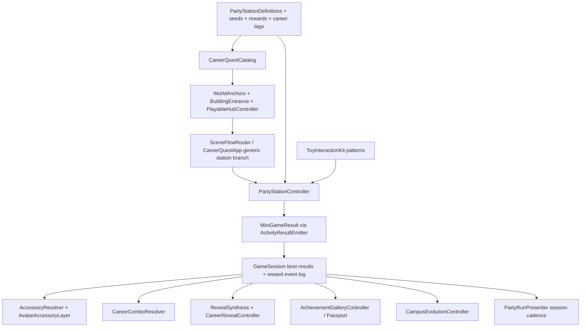

# feat: Party Campus Pack - station spine, toy challenges, rewards, and reveal ceremony

## Summary

Implement the locked Party Campus Pack as one scoped expansion: a generic station data spine, 10 playable free-choice career toy stations, session-only rewards and accessories, 30-path reveal synthesis, a demo-only Party Run cadence layer, classroom access controls, Wave 2 games, and the final character/accessory polish pass. The GStack CEO-review artifact is treated as the upstream review mirror; the repo-local source of truth for implementation is `docs/designs/party-campus-pack.md`.

This plan is sequenced for risk, not for cutting scope. Every in-plan station and system below ships in the final build, with no "coming soon" labels left on planned stations.

---

## Problem Frame

Career Quest Campus already has a functional persistent-scene spine: catalog entries, activity routes, room lifecycle, `MiniGameResult`, `GameSession`, gallery, reveal, campus evolution, and PlayMode tests. The current optional rooms, however, are still button-driven and route-specific. Scaling from four optional rooms to a "Mario Party for careers" campus would become switch/enum work unless station identity, toy patterns, result emission, rewards, and routing are made data-driven.

The product goal is a quick, classroom-safe loop: walk into any station, play a strange 45-75 second toy challenge, earn visible avatar gear, see the campus react, and later receive a strength-based personality ceremony. The implementation goal is to prove that loop once through Robotics Rescue, then multiply content through shared station definitions and interaction patterns instead of bespoke room controllers.

---

## Scope Boundaries

**In scope**

- All 10 in-plan stations: Robotics Rescue, AI Lab Sort, Community Kitchen Match, Music Remix, Vet Clinic Diagnose, Game Studio Compose, Weather Lab Rescue, Spaceport Pilot, Newsroom Story Sprint, and Green City Builder.
- Existing core rooms remain playable and continue to count toward reveal readiness.
- One default seed and one alternate seed per in-plan station.
- 4-6 active interactable objects per seed, with 3 primary objects plus helper, clue, reaction, wildcard, bonus, or meter objects.
- Generic station-id routing and walk-into-door auto-entry with dwell/cooldown.
- Session-only reward event log, accessory unlocks, combo cards, passport/gallery upgrades, and reveal synthesis.
- Party Run guided cadence for demo/proof only; normal campus play remains free-choice.
- Classroom access, quiet/reduced-motion mode, facilitator controls, copy safety, and local-only privacy posture.
- Full character art/accessory fit pass after the game loop is fun and stable.

**Out of scope**

- Accounts, profiles, chat, matchmaking, telemetry, analytics, export, saved child histories, teacher dashboard, or persistent wardrobe state.
- Procedural career text generation or AI-generated runtime copy.
- Separate Netcode-loaded scenes per station.
- More than one alternate seed per station in this plan; two additional alternates per station are a later replayability pass.
- Full dress-up editor. Accessories are derived visual rewards, not inventory management.

---

## Requirements

**Station campus and play**

- R1. Final build exposes all 10 in-plan stations as playable free-choice campus destinations, with no final "coming soon" labels or unplayable construction sites for planned stations.
- R2. Existing core activities continue to route, complete, emit results, count toward reveal readiness, and coexist with the Party Pack stations.
- R3. Every station ships with a default seed and one alternate seed; first play uses the default seed, replay may choose either seed, and demo/proof mode may request quick pacing without changing scoring.
- R4. Every seed uses 4-6 active interactables, at least 4 task/clue-chain objects, a short guide identity, intro/hint/escalation/success/reward-preview copy, and no inert listed toys.
- R5. Station pacing targets 45-75 seconds with recoverable hints, gentle reject feedback, and no harsh fail state.
- R6. Supported toy patterns are explicit and reusable: `DragToSlot`, `SortToBin`, `PickMatchingTrio`, `SequenceCards`, `ComposeSet`, `MatchAndCare`, and `BalanceMeters`.
- R7. Party Pack routing is station-id/catalog driven. `ActivityRoute` may keep high-level/legacy states, but it must not gain one enum value and one switch branch per new station.
- R8. Campus entry uses walk-into-zone auto-entry with a short dwell, route cooldown, return-to-campus grace period, nearby highlight, and non-overlapping entrance radii. Click-to-enter may remain as a convenience.

**Results, rewards, and reveal**

- R9. Every station emits exactly one normal `MiniGameResult` through the existing room lifecycle and duplicate gate. Station controllers do not directly mutate reveal, gallery, career ranking, accessories, or campus evolution.
- R10. `GameSession` remains the scoring source of truth: best results drive Career DNA, reveal readiness, badges, accessories, combo cards, and campus evolution.
- R11. Add a lightweight session-only reward event log for recent micro-results, selected seed id, seed-aware summary, top trait highlights, unlocked accessory id, and combo spark ids. Replays may append events even when they do not replace best result.
- R12. Accessories are visual/story rewards only. They never modify career scoring. Ship one core accessory per station plus milestone/ceremony accessories at 3, 5, 8, and 10 unique completions.
- R13. Career ranking expands to 30 reveal paths with family tags, strength-based taglines, and representative scoring calibration tests. At least 12 paths are directly station-backed in the first six-station wave.
- R14. Reveal synthesis shows top traits, top paths, career family, superpower, hybrid/combo identity, avatar accessories, and richer presentation styles at 3-4, 5-7, 8-9, and 10 unique completions.
- R15. Combo cards are static, handcrafted, session-only, derived from completed station pairs, and resolved through a `CareerComboResolver`; they add ceremony flavor but no score.

**Multiplayer, demo, classroom, and safety**

- R16. All 10 stations are solo-playable and 2P-safe/shared-progress. Host validates selected seed, accepted submissions, rejects, progress, and completion; clients submit actions and render accepted shared state without per-frame drag sync.
- R17. Multiplayer read models replicate only compact, session-scoped completion/reward facts needed for accessories, combos, gallery/passport, reveal, and campus reactions. They do not replicate persistent profiles or child-identifying histories.
- R18. `PartyRunPresenter` provides demo cadence with round intro, reward preview, progress strip, accessory spotlight, campus evolution beat, continue/quit, and reveal handoff. It must not force normal in-game station order.
- R19. Classroom access includes pointer-first completion paths, non-color-only cues, quiet/reduced-motion mode, early-reader copy, pretend-play safety rules, and local facilitator controls for reset current run, return to campus, mute/quiet, and restart demo route.
- R20. The final proof pack includes a 90-second demo route, a 3-minute impressive proof route, all-10 station smoke, 2P shared-progress evidence, classroom access smoke, route teardown/replay churn smoke, and accessory fit screenshots.

---

## Key Technical Decisions

- KTD1. **Repo-local design is the implementation source:** `docs/designs/party-campus-pack.md` remains the locked product/design source, while this plan maps it into engineering units. Do not fork behavior between the plan, design doc, and the GStack mirror.
- KTD2. **Static C# station definitions first:** use static definitions for `PartyStationDefinition`, seeds, objects, rewards, career tags, and copy. ScriptableObjects/JSON can come later after the station loop proves itself.
- KTD3. **Station-id routing over enum growth:** route Party Pack entrances by station/catalog id into one generic station branch. `ActivityRoute` stays useful for major app states and legacy/core rooms, not for every future station.
- KTD4. **Result-spine architecture:** completion flows `PartyStationController` -> `MiniGameResult` -> `GameSession`; rewards, reveal, gallery, passport, combos, and evolution derive from session results and metadata.
- KTD5. **Toy patterns are shared systems:** extend `Assets/_CareerQuest/Scripts/Interaction` into a `ToyInteractionKit` so station variety comes from definitions and toy pattern controllers, not ten separate mini-game engines.
- KTD6. **Robotics is the proof gate:** Robotics Rescue must demonstrate route, toy play, hinting, result emission, reward event, accessory spotlight, campus evolution, gallery, reveal compatibility, replay, and teardown before the remaining first-six stations multiply.
- KTD7. **Party Run is a presenter, not progression law:** guided/demo runs live in session-only state and can resume/quit, but free-choice campus station order remains the default game structure.
- KTD8. **Rewards are presentation, not scoring:** accessories and combo sparks make progress visible; career scoring remains explainable from trait deltas in best results.
- KTD9. **Reveal richness comes from one resolver:** `RevealSynthesis` selects presentation style, family, superpower, paths, and combo spotlight from shared inputs rather than adding bespoke reveal controllers per outcome.
- KTD10. **Wave 2 is gated, not optional:** Weather, Spaceport, Newsroom, and Green City start after the first-six pack is stable, but they are in this plan and must be playable in the final build.
- KTD11. **Full character art lands after gameplay:** accessory slots and simple overlays ship earlier; upgraded base avatars, accessory fit tuning, thumbnails, and reveal/campus consistency happen after stations are playable.
- KTD12. **Privacy posture stays local and session-scoped:** proof artifacts are explicit developer/demo outputs only and do not include child names, rosters, free text, analytics, or persisted personal data.

---

## High-Level Technical Design

`PartyStationController` owns station play and only emits results/events. Everything that looks like progression is derived downstream, which keeps multiplayer, replay, reveal, and classroom proof surfaces consistent.

---

## Existing Patterns To Follow

- `Assets/_CareerQuest/Scripts/Catalog/CareerQuestCatalog.cs` already defines public activity identity for campus, gallery, badges, routes, and art keys.
- `Assets/_CareerQuest/Scripts/Core/GameSession.cs` owns best results, Career DNA, reveal readiness, current route/phase, and the current compact network read-model seam.
- `Assets/_CareerQuest/Scripts/Core/MiniGameResult.cs` is the result contract; station results must use it unchanged unless a small backward-compatible field is necessary.
- `Assets/_CareerQuest/Scripts/Activities/Shared/ActivityRoomController.cs` and `Assets/_CareerQuest/Scripts/Activities/Shared/ActivityResultEmitter.cs` provide room lifecycle and duplicate-result protection.
- `Assets/_CareerQuest/Scripts/Interaction/DraggablePiece.cs`, `DropZone.cs`, `DragFeel.cs`, and `PartnerHoldIndicator.cs` provide the drag shell to reuse.
- `Assets/_CareerQuest/Scripts/Activities/DesignBuild/DesignBuildController.cs`, `HealthHeroController.cs`, and `LogicCourtController.cs` show the test seam pattern: programmatic `TrySubmitDrop`, state queries, reject events, and pointer input as a thin layer.
- `Assets/_CareerQuest/Scripts/World/WorldAnchors.cs` already centralizes campus entrance/walk-bound data and needs station-id support plus non-overlap validation.
- `Assets/_CareerQuest/Scripts/Hub/PlayerAvatarController.cs` currently requires E/Space/Return or click entry; this becomes dwell-based auto-entry.
- `Assets/_CareerQuest/Scripts/UI/CareerQuestApp.cs` currently mounts core rooms and optional rooms through route-specific methods; Party Pack stations need one generic mount path.

---

## Implementation Units

### U1. Station Definition Spine And Validation

**Goal:** Create the static data contract for all 10 stations, including default/alternate seeds, objects, guide copy, toy pattern ids, rewards, career tags, badges, campus art, and evolution ids.

**Requirements:** R1, R3, R4, R6, R12, R13, R19.

**Files:**

- Create: `Assets/_CareerQuest/Scripts/Config/PartyStationDefinition.cs`, `Assets/_CareerQuest/Scripts/Config/PartyStationDefinitions.cs`, `Assets/_CareerQuest/Scripts/Config/PartyStationSeedDefinition.cs`, `Assets/_CareerQuest/Scripts/Config/PartyStationObjectDefinition.cs`, `Assets/_CareerQuest/Scripts/Config/PartyStationValidator.cs`, `Assets/_CareerQuest/Scripts/Config/AccessoryRewardConfig.cs`, `Assets/_CareerQuest/Scripts/Config/CareerComboConfig.cs`
- Modify: `Assets/_CareerQuest/Scripts/Catalog/CareerQuestCatalog.cs`, `Assets/_CareerQuest/Scripts/Config/CareerConfig.cs`, `Assets/_CareerQuest/Scripts/Art/AssetCatalog.cs`, `Assets/_CareerQuest/Scripts/World/CampusEvolutionController.cs`
- Test: `Assets/_CareerQuest/Tests/EditMode/PartyStationDefinitionTests.cs`, `Assets/_CareerQuest/Tests/EditMode/CareerQuestCatalogTests.cs`, `Assets/_CareerQuest/Tests/EditMode/CareerConfigTests.cs`, `Assets/_CareerQuest/Tests/EditMode/AssetValidationTests.cs`, `Assets/_CareerQuest/Tests/EditMode/StationCopySafetyTests.cs`

**Test scenarios:**

- All 10 station ids are unique and share the same id across station definition, catalog entry, badge art key, result activity id, career tags, and campus evolution metadata.
- Every station has exactly one default seed and one alternate seed, with unique seed ids and seed overrides that reference known objects.
- Every seed has 4-6 active interactables, at least 4 active task/clue-chain objects, no unknown roles, no dead listed objects, and one supported `ToyPatternId`.
- Every station has guide identity plus intro, hint, escalation hint, success, reward preview, result summary, and NPC reaction copy.
- Copy validation fails on empty copy, overlong early-reader lines, unsupported career jargon, deterministic career phrases, or unsafe pretend-play wording.
- Every accessory, badge, campus art key, career tag, and evolution id resolves to known config or an intentional placeholder asset key.

**Dependencies:** None.

### U2. Generic Station Routing And Walk-In Auto-Entry

**Goal:** Replace Party Pack route sprawl with station-id routing and remove the required E-key door entry. The player enters a station by walking into its entrance area after a short dwell.

**Requirements:** R1, R2, R7, R8, R18.

**Files:**

- Modify: `Assets/_CareerQuest/Scripts/Core/ActivityRoute.cs`, `Assets/_CareerQuest/Scripts/Core/SceneFlowRouter.cs`, `Assets/_CareerQuest/Scripts/Catalog/CareerQuestCatalog.cs`, `Assets/_CareerQuest/Scripts/World/WorldAnchors.cs`, `Assets/_CareerQuest/Scripts/Hub/BuildingEntrance.cs`, `Assets/_CareerQuest/Scripts/Hub/PlayableHubController.cs`, `Assets/_CareerQuest/Scripts/Hub/PlayerAvatarController.cs`, `Assets/_CareerQuest/Scripts/UI/CareerQuestApp.cs`, `Assets/_CareerQuest/Scripts/UI/InstructionStrip.cs`
- Test: `Assets/_CareerQuest/Tests/EditMode/HubDestinationTests.cs`, `Assets/_CareerQuest/Tests/EditMode/SceneFlowRouterTests.cs`, `Assets/_CareerQuest/Tests/EditMode/WorldAnchorsTests.cs`, `Assets/_CareerQuest/Tests/PlayMode/HubNavigationFlowTests.cs`, `Assets/_CareerQuest/Tests/PlayMode/CampusHubWorldPlayModeTests.cs`, `Assets/_CareerQuest/Tests/PlayMode/AutoEntryPlayModeTests.cs`

**Test scenarios:**

- Entering a Party Pack station from the hub routes by station id into the generic station branch without adding one `ActivityRoute` value per station.
- Existing core and legacy optional routes continue to work while migration is in progress.
- Auto-entry fires only after the avatar remains inside the entrance radius for the dwell window and does not fire from a one-frame edge brush.
- Route cooldown prevents double-entry while the new route is mounting.
- Returning to campus applies a grace period before auto-entry can fire again.
- Click-to-enter still works when the click lands on an entrance and does not conflict with UI or drag targets.
- `WorldAnchors` validation catches overlapping entrance radii and missing readable district labels.
- Campus instruction copy says movement plus walk-into-door entry, not "Enter doors: E."

**Dependencies:** U1 for station ids and catalog data.

### U3. ToyInteractionKit And Shared Multiplayer Pattern Layer

**Goal:** Promote shared drag/drop, sorting, matching, sequence, compose, care, and meter rules into reusable station primitives, including 2P-safe host validation.

**Requirements:** R5, R6, R16, R17.

**Files:**

- Create: `Assets/_CareerQuest/Scripts/Interaction/ToyInteractionKit.cs`, `Assets/_CareerQuest/Scripts/Interaction/ToyPatternController.cs`, `Assets/_CareerQuest/Scripts/Interaction/ToyPatternRules.cs`, `Assets/_CareerQuest/Scripts/Interaction/ToySubmissionResult.cs`, `Assets/_CareerQuest/Scripts/Interaction/StationProgressNetworkState.cs`
- Modify: `Assets/_CareerQuest/Scripts/Interaction/DraggablePiece.cs`, `Assets/_CareerQuest/Scripts/Interaction/DropZone.cs`, `Assets/_CareerQuest/Scripts/Interaction/DragFeel.cs`, `Assets/_CareerQuest/Scripts/Activities/DesignBuild/DesignBuildController.cs`, `Assets/_CareerQuest/Scripts/Activities/HealthHero/HealthHeroController.cs`, `Assets/_CareerQuest/Scripts/Activities/LogicCourt/LogicCourtController.cs`, `Assets/_CareerQuest/Scripts/Core/CampusSessionState.cs`
- Test: `Assets/_CareerQuest/Tests/EditMode/ToyInteractionKitTests.cs`, `Assets/_CareerQuest/Tests/EditMode/ToyPatternRulesTests.cs`, `Assets/_CareerQuest/Tests/PlayMode/PartyStationNetworkStatePlayModeTests.cs`, `Assets/_CareerQuest/Tests/PlayMode/DesignBuildNetworkSeamPlayModeTests.cs`, `Assets/_CareerQuest/Tests/PlayMode/HealthHeroNetworkSeamPlayModeTests.cs`, `Assets/_CareerQuest/Tests/PlayMode/LogicCourtNetworkSeamPlayModeTests.cs`

**Test scenarios:**

- Each supported toy pattern accepts a golden valid action sequence and rejects unknown pieces, wrong slots/bins, occupied targets, locked submissions, and stale rejects.
- Host validates accepted submissions and rejects; clients render accepted progress from shared state and never rely on optimistic local-only completion.
- Reject responses target only the submitting client and echo a submission id so stale rejects cannot bounce newer drags.
- 2P shared state syncs selected seed, accepted progress, hint/highlight state, completion, and compact reward facts without syncing per-frame drag positions.
- Existing Design Build, Health Hero, and Logic Court drag seams keep passing after shared result types move out of `DesignBuildController`.
- Pattern teardown cancels active drags, clears highlight pulses, unsubscribes events, and removes transient toy objects on route change.

**Dependencies:** U1.

### U4. PartyStationController And Robotics Rescue Proof

**Goal:** Add the reusable station owner and prove the full result-spine loop with Robotics Rescue before multiplying content.

**Requirements:** R3, R4, R5, R6, R9, R10, R11, R12, R16, R19.

**Files:**

- Create: `Assets/_CareerQuest/Scripts/Activities/PartyStations/PartyStationController.cs`, `Assets/_CareerQuest/Scripts/Activities/PartyStations/PartyStationRoomState.cs`, `Assets/_CareerQuest/Scripts/Activities/PartyStations/PartyStationRenderer.cs`, `Assets/_CareerQuest/Scripts/Activities/PartyStations/StationGuideView.cs`, `Assets/_CareerQuest/Scripts/Activities/PartyStations/StationRewardPreview.cs`
- Modify: `Assets/_CareerQuest/Scripts/Activities/Optional/OptionalRoomController.cs`, `Assets/_CareerQuest/Scripts/UI/CareerQuestApp.cs`, `Assets/_CareerQuest/Scripts/World/CampusWorldController.cs`, `Assets/_CareerQuest/Scripts/World/CampusRoomScenes.cs`, `Assets/_CareerQuest/Scripts/Activities/Shared/ActivityResultEmitter.cs`
- Test: `Assets/_CareerQuest/Tests/EditMode/PartyStationControllerTests.cs`, `Assets/_CareerQuest/Tests/PlayMode/PartyStationRoboticsPlayModeTests.cs`, `Assets/_CareerQuest/Tests/PlayMode/StationLifecycleChurnPlayModeTests.cs`, `Assets/_CareerQuest/Tests/PlayMode/OptionalMiniGameFlowTests.cs`

**Test scenarios:**

- Robotics Rescue renders from `PartyStationDefinition`, selects default seed on first play, offers alternate seed on replay, and supports quick pacing for proof/demo.
- Guide intro, reward preview, hint ladder, escalation hint, success copy, and gentle reject feedback appear from station data.
- Completing Robotics emits one normal `MiniGameResult` with station id, display name, tier, source, time/accuracy, summary, and trait deltas.
- `ActivityResultEmitter` blocks duplicate completion from double-click, rerender, or route race.
- Completion appends a reward event, derives the tool belt accessory, makes Accessory Spotlight available, unlocks the robotics evolution piece, appears in gallery/passport state, and remains reveal-compatible.
- Replay can append a recent micro-result without inflating unique completion count or awarding a second station badge.
- Enter/exit/replay churn does not accumulate station roots, drag pieces, hint highlights, reward spotlights, combo spark surfaces, coroutines, or duplicate subscriptions.

**Dependencies:** U1, U2, U3.

### U5. First Six Station Pack

**Goal:** Convert or add the first six playable stations using the proven controller and shared toy patterns.

**Requirements:** R1, R2, R3, R4, R5, R6, R9, R16, R19.

**Files:**

- Modify: `Assets/_CareerQuest/Scripts/Config/PartyStationDefinitions.cs`, `Assets/_CareerQuest/Scripts/Activities/Optional/OptionalRoomController.cs`, `Assets/_CareerQuest/Scripts/Activities/PartyStations/PartyStationController.cs`, `Assets/_CareerQuest/Scripts/Activities/PartyStations/PartyStationRenderer.cs`, `Assets/_CareerQuest/Scripts/UI/CareerQuestApp.cs`, `Assets/_CareerQuest/Scripts/World/CampusWorldController.cs`, `Assets/_CareerQuest/Scripts/Art/AssetCatalog.cs`
- Test: `Assets/_CareerQuest/Tests/PlayMode/FirstSixStationPackPlayModeTests.cs`, `Assets/_CareerQuest/Tests/PlayMode/PartyStationRoboticsPlayModeTests.cs`, `Assets/_CareerQuest/Tests/PlayMode/StationLifecycleChurnPlayModeTests.cs`, `Assets/_CareerQuest/Tests/EditMode/PartyStationDefinitionTests.cs`

**Test scenarios:**

- Robotics Rescue proves `DragToSlot` plus route choice.
- AI Lab Sort proves `SortToBin`.
- Community Kitchen Match proves `PickMatchingTrio` plus serving confirmation.
- Music Remix proves compose/layering with meter or ordering feedback.
- Vet Clinic Diagnose proves `MatchAndCare` with pretend-play-safe care copy.
- Game Studio Compose proves compose/trio plus pitch.
- Every first-six station completes the default seed, emits a normal result, returns to campus, remains replayable, and exposes the alternate seed on replay.
- One creative station and one care/science station participate in the replay-churn smoke after the Robotics baseline.
- Existing core room tests and optional-flow tests still pass while optional routes are bridged or retired.

**Dependencies:** U4.

### U6. Rewards, Accessories, Passport, And Session Reward Events

**Goal:** Make station progress visible on the avatar, in the passport/gallery, and in recent micro-results without adding persistent wardrobe state.

**Requirements:** R10, R11, R12, R17, R20.

**Files:**

- Create: `Assets/_CareerQuest/Scripts/Core/RewardEvent.cs`, `Assets/_CareerQuest/Scripts/Core/RewardEventLog.cs`, `Assets/_CareerQuest/Scripts/Avatar/AvatarAccessoryLayer.cs`, `Assets/_CareerQuest/Scripts/Avatar/AccessoryResolver.cs`, `Assets/_CareerQuest/Scripts/UI/AccessorySpotlightController.cs`, `Assets/_CareerQuest/Scripts/UI/PassportController.cs`
- Modify: `Assets/_CareerQuest/Scripts/Core/GameSession.cs`, `Assets/_CareerQuest/Scripts/Core/CampusSessionState.cs`, `Assets/_CareerQuest/Scripts/Avatar/AvatarRuntimeView.cs`, `Assets/_CareerQuest/Scripts/Art/AssetCatalog.cs`, `Assets/_CareerQuest/Scripts/UI/AchievementGalleryController.cs`, `Assets/_CareerQuest/Scripts/UI/CareerQuestApp.cs`
- Test: `Assets/_CareerQuest/Tests/EditMode/GameSessionTests.cs`, `Assets/_CareerQuest/Tests/EditMode/AccessoryResolverTests.cs`, `Assets/_CareerQuest/Tests/PlayMode/AvatarAccessoryLayerPlayModeTests.cs`, `Assets/_CareerQuest/Tests/PlayMode/AchievementGalleryPlayModeTests.cs`, `Assets/_CareerQuest/Tests/PlayMode/CampusSessionStatePlayModeTests.cs`

**Test scenarios:**

- Completing a station derives exactly one core accessory from best results and does not let accessories affect career ranking.
- Milestone accessories derive from unique completion counts at 3, 5, 8, and 10 without adding a saved inventory.
- Slot rules show at most one visible accessory per slot in normal campus play and allow ceremony-only items during reveal.
- Accessory layers follow avatar transform, sort correctly, flip with facing, and do not visibly float or clip in representative screenshot checks.
- Reward events include selected seed id, seed-aware summary, top trait highlights, unlocked accessory id, and combo spark ids.
- Passport pages render Badges, Gear, Combos, and Results from session-derived state; locked entries do not expose seed choices, completed entries can replay through normal routing.
- Multiplayer compact read model lets clients render completed stations, accessories, combo eligibility, gallery/passport entries, reveal copy, and campus reactions consistently.

**Dependencies:** U4, U5 for station completions.

### U7. Career Expansion, Combo Cards, And Reveal Synthesis

**Goal:** Expand the ceremony from a score screen into a strength-based personality reveal with 30 career paths, families, superpowers, combo identities, and completion-count styles.

**Requirements:** R13, R14, R15, R19.

**Files:**

- Create: `Assets/_CareerQuest/Scripts/Config/CareerFamilyConfig.cs`, `Assets/_CareerQuest/Scripts/UI/RevealSynthesis.cs`, `Assets/_CareerQuest/Scripts/UI/CareerComboResolver.cs`
- Modify: `Assets/_CareerQuest/Scripts/Config/CareerConfig.cs`, `Assets/_CareerQuest/Scripts/UI/CareerRevealController.cs`, `Assets/_CareerQuest/Scripts/UI/RevealCinematicDirector.cs`, `Assets/_CareerQuest/Scripts/UI/DemoDebugOverlay.cs`, `Assets/_CareerQuest/Scripts/Activities/Shared/CeremonyController.cs`
- Test: `Assets/_CareerQuest/Tests/EditMode/CareerConfigTests.cs`, `Assets/_CareerQuest/Tests/EditMode/CareerComboResolverTests.cs`, `Assets/_CareerQuest/Tests/EditMode/RevealSynthesisTests.cs`, `Assets/_CareerQuest/Tests/EditMode/StationCopySafetyTests.cs`, `Assets/_CareerQuest/Tests/PlayMode/ShowcaseRevealFlowTests.cs`, `Assets/_CareerQuest/Tests/PlayMode/RevealCinematicPlayModeTests.cs`

**Test scenarios:**

- Representative Care-heavy, Tech-heavy, Creative-heavy, Build-heavy, Nature-heavy, Story-heavy, Justice/Leadership-heavy, and Balanced Explorer profiles produce plausible top-five paths and at least one expected family.
- First-wave station-backed paths appear when their trait profiles are strongest; reveal-supported paths do not require their own building.
- Combo cards unlock from completed station pairs, do not add score, and select one primary combo by strongest traits, most recent station, then authored priority.
- Reveal style changes at 3-4, 5-7, 8-9, and 10 unique completions through one `RevealSynthesis` path.
- Reveal copy uses "you practiced", "you might like", and "your strengths today" style language and fails validation on deterministic career phrases.
- Accessories remain visible through reveal and combo spotlight can layer on top of any completion-count style.

**Dependencies:** U1, U6.

### U8. Campus Layout, Evolution, And Visual Station Presence

**Goal:** Make the campus read as a 10-station party map with districts, clear entrances, evolution pieces, and local visual reactions.

**Requirements:** R1, R8, R12, R20.

**Files:**

- Modify: `Assets/_CareerQuest/Scripts/World/WorldAnchors.cs`, `Assets/_CareerQuest/Scripts/World/CampusWorldBuilder.cs`, `Assets/_CareerQuest/Scripts/World/CampusWorldController.cs`, `Assets/_CareerQuest/Scripts/World/CampusWorldSprites.cs`, `Assets/_CareerQuest/Scripts/World/CampusEvolutionController.cs`, `Assets/_CareerQuest/Scripts/Art/AssetCatalog.cs`, `Assets/_CareerQuest/Scripts/UI/DemoDebugOverlay.cs`
- Test: `Assets/_CareerQuest/Tests/EditMode/WorldAnchorsTests.cs`, `Assets/_CareerQuest/Tests/EditMode/AssetValidationTests.cs`, `Assets/_CareerQuest/Tests/PlayMode/CampusEvolutionPlayModeTests.cs`, `Assets/_CareerQuest/Tests/PlayMode/CampusHubWorldPlayModeTests.cs`, `Assets/_CareerQuest/Tests/PlayMode/StationPackSmokePlayModeTests.cs`

**Test scenarios:**

- Campus displays core stations, first-six stations, and Wave 2 stations in readable districts with no tiny labels or crowded door row.
- Entrance circles do not overlap, highlights show which station will open, and actual auto-entry radii remain controlled.
- Each station has a badge key, campus art key, and city/evolution prop key.
- Completing each station unlocks a corresponding campus evolution piece and optional ambient reaction without direct station-controller side effects.
- Development builds may show temporary construction labels before implementation, but final station-pack smoke fails if any in-plan station remains unplayable or labeled "coming soon."

**Dependencies:** U1, U2, U6.

### U9. PartyRunPresenter, Classroom Access, And Facilitator Controls

**Goal:** Add the impressive demo cadence and classroom controls without changing the normal free-choice game structure.

**Requirements:** R18, R19, R20.

**Files:**

- Create: `Assets/_CareerQuest/Scripts/UI/PartyRunPresenter.cs`, `Assets/_CareerQuest/Scripts/Core/PartyRunState.cs`, `Assets/_CareerQuest/Scripts/UI/ClassroomAccessSettings.cs`, `Assets/_CareerQuest/Scripts/UI/FacilitatorControlsController.cs`
- Modify: `Assets/_CareerQuest/Scripts/Core/GameSession.cs`, `Assets/_CareerQuest/Scripts/UI/CareerQuestApp.cs`, `Assets/_CareerQuest/Scripts/UI/PauseMenuController.cs`, `Assets/_CareerQuest/Scripts/UI/DemoDebugOverlay.cs`, `Assets/_CareerQuest/Scripts/Activities/Shared/AudioCueCatalog.cs`, `Assets/_CareerQuest/Scripts/World/CameraDirector.cs`, `Assets/_CareerQuest/Scripts/World/SceneWipe.cs`
- Test: `Assets/_CareerQuest/Tests/PlayMode/PartyRunPresenterPlayModeTests.cs`, `Assets/_CareerQuest/Tests/PlayMode/ClassroomAccessPlayModeTests.cs`, `Assets/_CareerQuest/Tests/PlayMode/PauseMenuPlayModeTests.cs`, `Assets/_CareerQuest/Tests/PlayMode/DemoDebugOverlayTests.cs`

**Test scenarios:**

- Starting a guided party run sets ordered station ids, selected seed ids, current round index, completed station ids, active/complete flags, and progress strip state.
- Guided run resumes after return to campus, gallery visit, or non-run room; quitting clears only guided sequencing state and preserves earned results, accessories, badges, traits, and evolution pieces.
- Normal campus play can enter any available station in any order without starting or obeying Party Run.
- Quiet/reduced-motion mode suppresses or simplifies particles, wipes, spotlight intensity, looping audio, and camera flourish while preserving completion clarity.
- Facilitator controls reset current run, return to campus, mute/quiet, and restart demo route without deleting session-earned results unless the control explicitly says it starts over.
- Pointer-first station completion works without keyboard-only precision; non-color cues exist for match/sort/route decisions.
- Proof capture/debug output excludes child names, rosters, free-text personal data, telemetry, and persistent identifiers.

**Dependencies:** U2, U4, U6, U7.

### U10. Wave 2 Station Pack

**Goal:** Implement Weather Lab Rescue, Spaceport Pilot, Newsroom Story Sprint, and Green City Builder with the same station spine and one new `BalanceMeters` primitive.

**Requirements:** R1, R3, R4, R5, R6, R9, R12, R16, R20.

**Files:**

- Modify: `Assets/_CareerQuest/Scripts/Config/PartyStationDefinitions.cs`, `Assets/_CareerQuest/Scripts/Interaction/ToyPatternRules.cs`, `Assets/_CareerQuest/Scripts/Activities/PartyStations/PartyStationController.cs`, `Assets/_CareerQuest/Scripts/Activities/PartyStations/PartyStationRenderer.cs`, `Assets/_CareerQuest/Scripts/World/CampusWorldController.cs`, `Assets/_CareerQuest/Scripts/World/CampusEvolutionController.cs`, `Assets/_CareerQuest/Scripts/Art/AssetCatalog.cs`
- Test: `Assets/_CareerQuest/Tests/EditMode/PartyStationDefinitionTests.cs`, `Assets/_CareerQuest/Tests/EditMode/ToyPatternRulesTests.cs`, `Assets/_CareerQuest/Tests/PlayMode/Wave2StationPackPlayModeTests.cs`, `Assets/_CareerQuest/Tests/PlayMode/StationPackSmokePlayModeTests.cs`, `Assets/_CareerQuest/Tests/PlayMode/StationLifecycleChurnPlayModeTests.cs`

**Test scenarios:**

- Weather Lab Rescue proves sequence plus protect with safe weather/emergency pretend-play copy.
- Spaceport Pilot proves `SequenceCards` navigation and route repair.
- Newsroom Story Sprint proves fact-checking compose/match with source-safe copy.
- Green City Builder proves `BalanceMeters` with two meter constraints and no harsh failure state.
- Each Wave 2 station has default and alternate seeds, one accessory, city/evolution piece, valid career tags, normal result output, replay seed selection, and gallery/reveal compatibility.
- All-10 station smoke iterates every station through generic station-id routing, completes the default seed in quick/golden mode, returns to campus, and re-enters for replay.

**Dependencies:** U5, U8.

### U11. Final Character Art, Accessory Fit, And Proof Pack

**Goal:** Finish the visual bar after gameplay is stable: upgraded character art, accessory fit, final campus station visibility, demo routes, proof artifacts, and regression gates.

**Requirements:** R1, R12, R18, R19, R20.

**Files:**

- Modify: `Assets/_CareerQuest/Scripts/Avatar/AvatarConfig.cs`, `Assets/_CareerQuest/Scripts/Avatar/AvatarRuntimeView.cs`, `Assets/_CareerQuest/Scripts/Avatar/AvatarPreviewController.cs`, `Assets/_CareerQuest/Scripts/Avatar/AvatarAccessoryLayer.cs`, `Assets/_CareerQuest/Scripts/Art/AssetCatalog.cs`, `Assets/_CareerQuest/Scripts/UI/CareerRevealController.cs`, `Assets/_CareerQuest/Scripts/World/CampusWorldSprites.cs`, `Assets/_CareerQuest/Scripts/UI/DemoDebugOverlay.cs`
- Test: `Assets/_CareerQuest/Tests/EditMode/AvatarConfigTests.cs`, `Assets/_CareerQuest/Tests/EditMode/AssetValidationTests.cs`, `Assets/_CareerQuest/Tests/PlayMode/AvatarAccessoryLayerPlayModeTests.cs`, `Assets/_CareerQuest/Tests/PlayMode/StationPackSmokePlayModeTests.cs`, `Assets/_CareerQuest/Tests/PlayMode/PartyRunPresenterPlayModeTests.cs`, `Assets/_CareerQuest/Tests/PlayMode/ClassroomAccessPlayModeTests.cs`

**Test scenarios:**

- Base avatars show visibly cleaner proportions or a clear polish pass compared with the current set.
- At least 6 accessory slots are supported and at least 10 station accessories exist, one per station.
- Badge sash, explorer cape or creator vest, star robe or campus crown, and 10-completion reveal flourish render under slot/clutter rules.
- Avatar accessories render in campus, station-end spotlight, passport/gallery, and reveal.
- Screenshot checks cover 4 representative avatars with 3+ accessories each and catch obvious floating, clipping, sorting, or thumbnail mismatch.
- 90-second demo route and 3-minute impressive proof route both reach reveal with accessories, top traits, top paths, superpower, family, and hybrid identity visible.
- Final proof pack runs all planned smoke tests and contains no planned station marked as locked, coming soon, or construction-only.

**Dependencies:** U6, U7, U8, U9, U10.

---

## Sequencing And Gates

- Gate A: U1-U4. Station schema, station-id routing, shared toy patterns, and Robotics Rescue proof are stable.
- Gate B: U5-U7. First six stations, reward loop, passport/gallery, career expansion, combos, and reveal synthesis are playable together.
- Gate C: U8-U10. Campus layout/evolution and Wave 2 bring the final 10-station map online.
- Gate D: U11. Character art, accessory fit, classroom proof, demo cadence, all-10 smoke, and final visual bar are locked.

These gates are implementation order only. They are not scope cuts.

---

## Acceptance Examples

- AE1. Given a new player on campus, when they walk into the Robotics entrance and remain inside the zone for the dwell window, then Robotics Rescue opens without pressing E, completes through the toy interaction, emits one `MiniGameResult`, awards the tool belt, and returns to campus.
- AE2. Given a player who replays AI Lab Sort, when they choose the alternate seed, then the station shows alternate prompt/object/result copy while preserving the same station id, badge identity, accessory, and unique completion count.
- AE3. Given two connected players in a Party Pack station, when client player submits a wrong object and then a correct object, then only the submitting client receives the reject bounce and both players see accepted shared progress from host state.
- AE4. Given a player completes 5 unique stations, when they open reveal, then reveal shows a richer style with top traits, top paths, family, superpower, visible accessories, and any eligible combo without deterministic career language.
- AE5. Given a guided Party Run is active, when the player visits gallery and returns to campus, then Continue Party Run resumes the next round while free-choice station entry still works outside that run.
- AE6. Given quiet/reduced-motion mode is active, when a station completes, then the result remains clear through copy/icon/state changes while particles, camera flourish, and audio intensity are reduced.
- AE7. Given the final build, when `StationPackSmokePlayModeTests` iterates planned stations, then all 10 are playable through generic station-id routing and none are construction-only or labeled "coming soon."
- AE8. Given proof capture/debug commands run, when artifacts are generated, then they omit names, rosters, free text, analytics identifiers, and persisted child data.

---

## System-Wide Impact

- **Routing:** `ActivityRoute`, `SceneFlowRouter`, hub entrances, world anchors, and app mounting must support station ids so future station additions do not create enum/switch churn.
- **Session state:** `GameSession` gains reward events, Party Run state, and richer read-model data while preserving best-result semantics.
- **Networking:** station interactions share a host-validated pattern layer and compact session read model; no station syncs per-frame drag or persistent profile data.
- **UI:** gallery/passport, reveal, pause/facilitator controls, instruction copy, reward spotlight, and debug overlay all read derived session state.
- **World/art:** campus layout, evolution pieces, station props, badge art, accessories, and final avatars need asset catalog coverage and validation.
- **Tests:** existing core-room, drag, routing, reveal, and campus tests must keep passing while new station-pack tests cover breadth.

---

## Risks And Mitigations

| Risk | Mitigation |
|---|---|
| Station data duplicates catalog/career/evolution ids | U1 validation fails on id mismatch, unknown career tags, missing badge art, missing evolution ids, and duplicate station/seed/object ids. |
| Enum/switch sprawl returns during pressure | U2 explicitly gates on adding a station through metadata plus generic routing rather than adding one `ActivityRoute` per station. |
| Art production starts before gameplay is fun | U11 places the full character art set after Robotics, first six, rewards, reveal, campus, and Wave 2 are playable. |
| 10 stations create QA sprawl | Robotics gets deep proof; all stations get definition validation and all-10 smoke; pattern-level tests cover shared mechanics. |
| Multiplayer drift between host and clients | U3 centralizes host validation, reject targeting, shared accepted progress, selected seed, and compact reward facts. |
| Reward events become a second profile | U6 keeps reward events session-only and presentation-only; best results remain scoring truth. |
| Reveal becomes a pile of labels | U7 uses one `RevealSynthesis` priority resolver for paths, family, superpower, combo, accessories, and completion style. |
| Auto-entry feels accidental | U2 adds dwell, cooldown, return grace, and highlight-before-entry; U8 validates non-overlapping entrance radii. |
| Classroom or child-safety issues slip in | U1/U7 copy scans plus U9 classroom smoke enforce early-reader, strength-based, pretend-play-safe, local-only rules. |

---

## Sources And References

- Source requirements: `docs/brainstorms/2026-06-12-party-campus-pack-requirements.md`
- Locked design/GStack review source: `docs/designs/party-campus-pack.md`
- Current catalog identity: `Assets/_CareerQuest/Scripts/Catalog/CareerQuestCatalog.cs`
- Current session/result spine: `Assets/_CareerQuest/Scripts/Core/GameSession.cs`, `Assets/_CareerQuest/Scripts/Core/MiniGameResult.cs`
- Current routing surface: `Assets/_CareerQuest/Scripts/Core/ActivityRoute.cs`, `Assets/_CareerQuest/Scripts/Core/SceneFlowRouter.cs`, `Assets/_CareerQuest/Scripts/UI/CareerQuestApp.cs`
- Current optional-room bridge target: `Assets/_CareerQuest/Scripts/Activities/Optional/OptionalRoomController.cs`
- Current drag/test seam examples: `Assets/_CareerQuest/Scripts/Activities/DesignBuild/DesignBuildController.cs`, `Assets/_CareerQuest/Scripts/Activities/HealthHero/HealthHeroController.cs`, `Assets/_CareerQuest/Scripts/Activities/LogicCourt/LogicCourtController.cs`
- Current hub/auto-entry touchpoints: `Assets/_CareerQuest/Scripts/World/WorldAnchors.cs`, `Assets/_CareerQuest/Scripts/Hub/BuildingEntrance.cs`, `Assets/_CareerQuest/Scripts/Hub/PlayableHubController.cs`, `Assets/_CareerQuest/Scripts/Hub/PlayerAvatarController.cs`
- Current test roots: `Assets/_CareerQuest/Tests/EditMode`, `Assets/_CareerQuest/Tests/PlayMode`
